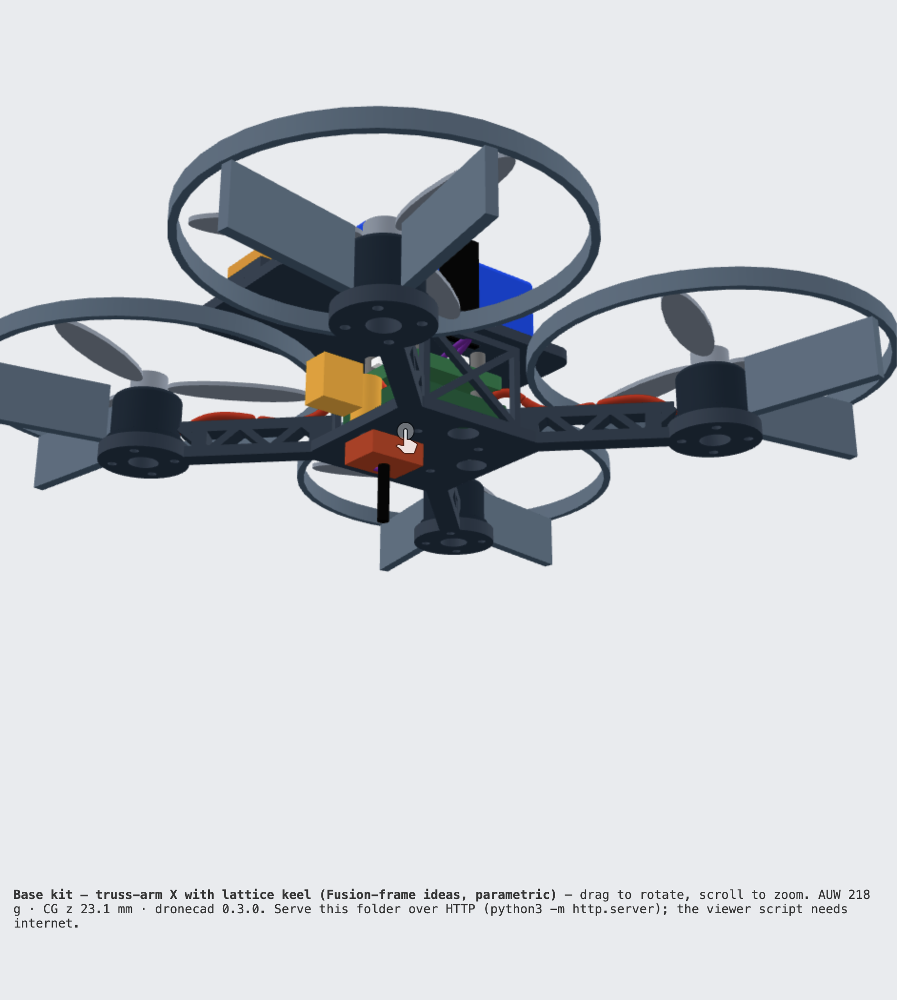
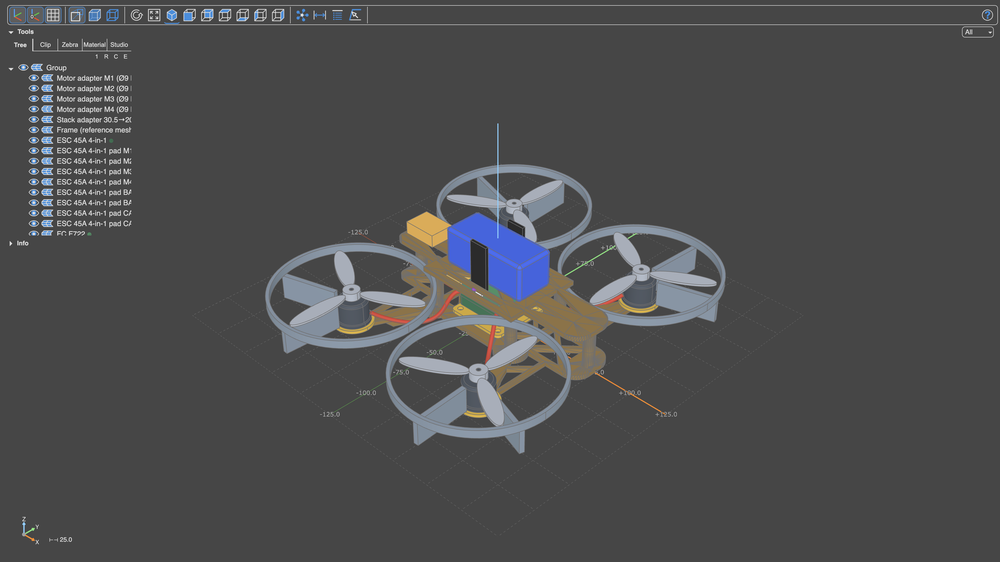

# Drone-building — 3-D models, checks and simulation (`cad/`)

**Status:** cad 0.3 / `dronecad` 0.3.0, Sep 12 2026. Built from parts list **v4** numbers in `bom.json` (Explorer 1000 pack, G45M ESC, XR2 Nano). Nothing here has been printed or flown. This folder answers "what will the kit look like, weigh, balance, survive and fly like" *before* anyone buys a frame, prints a part or opens Onshape — and it is now a **reusable framework**: point it at another kit directory (`bom.json` + `variants.json`) or at a third-party frame STL and the same checks run.

Two generators share the same inputs and the same base physics:

| | [`scripts/build_drone_model.py`](../../../../scripts/build_drone_model.py) — voxel | [`scripts/dronecad/`](../../../../scripts/dronecad/) — **exact CAD framework** (build123d) |
|---|---|---|
| Dependencies | none (Python 3 stdlib) | `scripts/.venv-cad`: `build123d` (OpenCascade), `gmsh`, `scipy` — see Run |
| Geometry | 1 mm voxels | exact B-rep: cylinders, fillets, vertical truss arms, lattice keel, swept wire bundles, vendor STEP parts |
| Per variant | ~2 s | ~90 s (≈ 25 s geometry + interference, ≈ 40 s FEA, rest sims + print checks) |
| Best at | fast sweeps, ASCII/SVG sketches with marks | **fit to 0.1 mm³**, printable STLs + print checks, STEP for Onshape, FEA (stress, deflection, first modes), Betaflight-PID sim with gust, ESC thermal, analysing someone else's frame against the kit |
| Outputs | `assembly.stl/.obj`, `frame.stl`, `top/side/front/iso.svg`, `slices.txt`, `marks.json`, `physics.json`, `report.md`, `sim-hover.csv` | `assembly.step`, `assembly.glb` + `viewer.html`, `print/*.stl` (+ `frame-bottom.step`), `cad.json`, `cad-report.md`, `sim-hover-cad.csv`, `sim-betaflight-gust.csv`; `reference/<name>/reference-report.md` for external meshes |



**Frame study (Sep 18 2026):** [`frame-215mm-study.md`](frame-215mm-study.md) — can the Tony 5 be the Base frame? Six variants at 150 / 215 mm, the 3.5" powertrain vs two placeholder 5" powertrains, with input provenance and a validation section. Verdict: 215 mm passes with the **existing 3.5" powertrain** (228.7 g, 17/18); a real 5" powertrain fails on weight, ESC headroom, guard fouling and prop clearance. Repo `bom.json` / `variants.json` untouched — scratch kits only.

## Run

```bash
# voxel (no setup)
python3 scripts/build_drone_model.py                  # all variants → cad/generated/

# exact CAD framework (one-off setup; build123d 0.11 + gmsh 4.15 + scipy run on Python 3.14)
python3 -m venv scripts/.venv-cad && scripts/.venv-cad/bin/pip install build123d gmsh scipy
cd scripts
.venv-cad/bin/python -m dronecad list                          # variants + kit resources
.venv-cad/bin/python -m dronecad build                         # all variants (~10 min) → cad/generated/<variant>/ + comparison-cad.md
.venv-cad/bin/python -m dronecad build -v base-truss           # one variant
.venv-cad/bin/python -m dronecad build -v base-x --no-fea      # ~50 s, skip FEA
.venv-cad/bin/python -m dronecad reference ../assets/courses/drone-building/cad/reference/fusion-frame-20260911.stl
.venv-cad/bin/python -m dronecad build -v reference-fusion     # kit parts mounted on the imported Fusion frame (~3.5 min)
.venv-cad/bin/python -m dronecad compare                       # comparison-cad.md from what is already built
.venv-cad/bin/python -m dronecad build -k /path/to/other-kit   # any directory with bom.json + variants.json

# rotate it: serve the folder (the viewer fetches assembly.glb, which file:// blocks) and open viewer.html
cd assets/courses/drone-building/cad/generated && python3 -m http.server 8765   # → http://localhost:8765/base-truss/viewer.html

# live model beside the code (OCP CAD Viewer): open the panel (Cmd-Shift-P → "OCP CAD Viewer: Open viewer")
# or run the standalone page (.venv-cad/bin/python -m ocp_vscode → http://127.0.0.1:3939/viewer), then
.venv-cad/bin/python -m dronecad view -v base-truss            # builds and pushes every labelled body; --keepouts adds RF boxes
```

`scripts/build_drone_cad.py` still works as a wrapper for `dronecad build`.

**Viewing / editing tools installed on the dev Mac (Sep 2026):** OrcaSlicer 2.4 (`brew install --cask orcaslicer`), FreeCAD 1.0 (`brew install --cask freecad`), the OCP CAD Viewer 4.0.1 extension in Cursor (VSIX from GitHub — it is not on the Open VSX marketplace) plus `ocp_vscode` in `.venv-cad`.

| Want to… | Use |
|---|---|
| Rotate a finished build in the browser | `viewer.html` (glTF) as above, or `assembly.glb` in macOS Quick Look |
| Open ours and the Fusion frame together, measure, section, edit, re-export | FreeCAD: File → Import `assembly.step` (113 labelled bodies) and `reference/fusion-frame-20260911.stl` |
| Watch the model change while editing `variants.json` / `frame.py` | `dronecad view` into the OCP CAD Viewer panel |
| Share with a student on a Chromebook | Onshape → Import `assembly.step` (browser, no install) |
| Prepare a print | OrcaSlicer → open `print/*.stl` (already on the bed); the framework also drives Orca's CLI for the report figures |

Optional inputs the framework picks up automatically when present in the kit directory:

| File | Effect |
|---|---|
| `parts/<component>/part.step` (+ `part.json` with `origin_offset_mm`) | Tier-C vendor geometry replaces the generated stand-in for `stack_esc`, `stack_fc`, `motor`, `o4_air_unit` |
| `thrust-stand.csv` (`rpm,thrust_g,current_a[,voltage_v]`) | Ct / Cp and max thrust/current are fitted from data instead of the constants in `bom.json` (or pass `--thrust-stand file.csv`) |
| PrusaSlicer / OrcaSlicer installed | real filament grams and print time are added next to the estimates (`--slicer PATH` to point at one). Orca's CLI is driven with its bundled profiles flattened on the fly (default: generic 250 mm Klipper printer, `0.20mm Standard`, `Generic <material> @System`, 3 walls / 30 % infill / 4 top-bottom layers to match the estimator); set `DRONECAD_ORCA_MACHINE="BBL:Bambu Lab P1S 0.4 nozzle"` (any `Vendor:Machine` from Orca's `Resources/profiles`) to slice for a specific printer |

## What `dronecad build` does per variant

Package layout (`scripts/dronecad/`): `spec` (kit loading, defaults) → `parts` (Tier A/B/C component solids, keep-outs, antennas) + `geom` → `frame` (`FrameBuild`: plates, arms, keel, guards, wire routes, exact arm sections) → `checks` (interference, prop shells, keep-outs) → `massprops` → `physics` (propulsion, section beam check, Betaflight sim, thermal) → `printcheck` → `fea` → `report` / `cli`. A future kit changes only its JSON; a new frame idea is a variant or a new `arm_style`.

1. **Geometry.** Bottom unibody (centre plate, arms, motor pads, optional lightening cutouts, arm-root fillets, optional lattice keel), top plate with BeeID pocket and strap slots, guards, camera plates on Video; components placed from `bom.json`; **wires swept along splines** (motor leads, battery leads, RX harness) so lead length and wire-to-prop clearance are real; **RF keep-outs** (BeeID sky-view cone, RX antenna) as transparent bodies.
   `arm_style`: `solid` (bar) · `truss` (vertical Warren truss — chords top/bottom, diagonals in the x–z plane, the topology of the Fusion reference frame) · `truss-flat` (planar). Truss knobs: `truss_height`, `truss_chord`, `truss_web`; `keel: true` adds lattice side walls between the plates; `plate_cutouts: true` opens four Ø8 holes under the ESC; `root_fillet` radius at the arm–plate junction.
2. **Fit checks (exact).** Pairwise intersection volumes with a by-design whitelist (fasteners, spokes on pads, wires on pads, hub on shaft); prop strike; a 3 mm swept-disc shell around every prop (wires included); keep-outs free; stack clear height; tip gaps; wheelbase; motor lead length from the swept route; O4 FOV cone on Video.
3. **Mass properties.** Printed parts = volume × density × `print_solidity`; bought parts = BOM mass; wires = swept volume × 1.6 g/cm³ (taken out of the BOM wiring lump); CG and the full inertia tensor about the CG.
4. **Structure.** Exact arm cross-sections at three stations (area, I about the transverse axis, extreme fibre) feed the Euler–Bernoulli check — so a truss arm is judged on its real section, not w·t³/12. Then **FEA of the bottom frame**: gmsh meshes the exported STEP into 10-node tets (4 mm default, `--fea-size`), a numpy/scipy linear-elastic solver clamps the standoff footprint and applies three cases — max thrust on all pads, 10 g × AUW vertical crash on one arm tip, 10 g lateral — and reports max and p99 von Mises, safety factor (p99 basis; the max sits on the clamp-edge singularity), displacement, hotspot, and the first three modes with motor + prop + guard mass lumped on the pads. Validated against a cantilever: deflection and first mode within 15 % (the clamped disc shortens the arm), analytic 12×4 arm 51 Hz vs FEA 52 Hz.
5. **Flight dynamics.** Two sims on the exact mass properties: the fixed-gain reference sim from the voxel script (unequal hover thrusts from the CG offset), and a **Betaflight 4.5 default-PID angle-mode sim** (P/I/D scale constants, 4 kHz loop, D-term LPF, thrust ∝ command², 20 ms motor lag) flying a 15° roll step and a 5 m/s side gust whose drag acts at the battery centroid — reports peak angles, settle time, drift during the gust, motor saturation.
6. **ESC thermal.** Lumped Rds(on) + switching loss at hover and 50 % throttle vs convection (35 W/m²K in prop wash, 15 behind keel walls) → ΔT.
7. **Manufacturability** of every `print/*.stl`: overhang area > 45° from the tessellation (excluding the bed layer), thin walls (< 0.9 mm) via 2-D morphological opening of slices, holes under Ø2 mm from the B-rep, filament mass and print time from a shell/infill model (3 perimeters, 4 top/bottom layers, 30 % infill, ~3.5 mm³/s) — plus real slicer numbers if a slicer CLI is installed. > 15 % overhang fails; 2–15 % passes with "print with supports".

Everything lands in `cad-report.md` (human) and `cad.json` (machine); `comparison-cad.md` has one row per variant.

## What `dronecad reference <frame.stl>` does

For a frame someone else designed (here the Sep 11 Fusion 360 frame, kept as `reference/fusion-frame-20260911.stl`): mesh stats (watertight, shells, envelope, volume → mass in a chosen material), horizontal plateaus (plate tops/undersides → stack clear height), circular holes from mesh slices, **hole-pattern recognition** (stack 16/20/25.5/30.5, motor 9/12/16/19 and Ø9/Ø12 bolt circles) → motor positions, wheelbase, prop tip and guard clearance with the kit's props, kit-fit pass/fail, overhang share, and the same FEA (largest closed shell remeshed through gmsh's surface reparametrisation, clamped at the detected stack pattern, kit motor loads on the detected pads). Output: `generated/reference/<name>/reference-report.md` + `reference.json`.

Findings on the Fusion frame: 30.5 mm stack (kit needs 20 × 20), Ø9 diamond motor pattern (kit needs 12 × 12), wheelbase 166 mm (target 150–160), 23 mm clear height, 42 g in PETG, watertight two-body mesh; first modes ≈ 44–48 Hz with the kit's 1404 motors, p99 stress at max thrust ≈ 12 MPa. Its arm and keel *topology* is what `base-truss` borrows.

## Mounting the kit on a third-party frame (`frame_stl` variants, Sep 15)

A variant can use an imported mesh **as** its frame instead of the parametric plates: set `"frame_stl": "reference/<file>.stl"` plus `frame_rotate_z_deg` (and optionally `frame_origin`). `FrameBuild` then reads the STL into one B-rep solid (build123d `Mesher`, 7.7 k planar faces — booleans still take ~1 s each), detects plate levels, holes, stack and motor patterns, re-centres on the stack pattern, rotates into kit axes, and runs the *same* component placement, interference, prop-shell, keep-out, wire, mass, FEA (gmsh on the STL in kit axes) and slicer steps as every other variant. Mount mismatches are resolved the way a builder would and reported as NOTEs: a printed **stack adapter plate** (mesh pattern below, kit pattern above, stack sits 2 mm higher) and a printed **motor adapter disc** per pad when the kit's bolt holes fall over air (checked by intersecting Ø2.2 cores with the pad). The mesh's own top deck (if it has plateaus ≥ 10 mm up) carries the battery, strap and BeeID; otherwise the kit's printed top plate and standoffs are added. Existing parametric variants are untouched (`_frame_printed` / `_frame_from_mesh` feed one `_components` stage); the voxel script skips `frame_stl` variants.



`reference-fusion` result (20 / 21 checks): AUW 222 g with 42 g of frame + 4 g of adapters, T/W 6.9, 15 min hover, CG on the prop plane. **12 of 16 motor-screw positions are over air** on its Ø9-pattern pads, so four 0.9 g adapter discs are added; the 30.5 → 20 × 20 stack adapter weighs 3 g. **The one hard FAIL is real:** the kit's 3.5" props pass **2.0 mm** from the six deck posts (the frame was drawn for 3" props — with 76 mm props the gap is ≈ 8 mm), so on this frame the kit needs 3" props or the posts moved inboard. Structure: FEA SF 4.1 at max thrust / 0.8 at a 10 g crash, first mode 36 Hz (below the idle band — fine), beam SF 4.5 on the truss arm section sliced from the mesh. Print: 40.5 g PETG, 2 h 38 min for the frame (Orca, flight orientation — orient per body when actually printing) + adapters + guards.

## Variants (Sep 12)

| Variant | Kit | Idea |
|---------|-----|------|
| `base-x` | Base | Reference: true-X 150 mm, PETG unibody, solid 12 × 4 arms, top battery, BeeID pocket aft |
| `base-x-lowbat` | Base | Same frame, pack under the bottom plate — CG below the prop plane |
| `base-stretch-x` | Base | Longer pitch axis (132 × 100 mm) |
| `base-h` | Base | Two straight rails + cross spars; prints flat |
| **`base-truss`** | Base | **Vertical Warren-truss arms (6 wide × 10 tall) + lattice keel + plate cutouts** — the Fusion frame's structure, parametric, fitting the kit |
| `video-x` | Video | CF stand-in for the open 3.5" frame + O4 board and camera |
| `video-deadcat` | Video | Front arms wider/forward to move props out of the O4 view |
| `reference-fusion` | Base | **Kit parts on the imported Fusion frame mesh** (`frame_stl`); printed stack + motor adapters; finds the 3.5" prop-to-post clearance problem |

Headline numbers live in [`generated/comparison-cad.md`](generated/comparison-cad.md) (exact) and [`generated/comparison.md`](generated/comparison.md) (voxel). Sep 12 run: base kit 213–219 g AUW with the 66 g Explorer pack (voxel agrees within 2 g), T/W ≈ 7, hover ≈ 38 % rpm at ≈ 3 A → ≈ 16 min on 1000 mAh, CG 1–2 mm above the prop plane with the pack on top (16 mm below on `base-x-lowbat`); all base variants pass every check. **Structure is where the variants differ:** solid 12 × 4 PETG arms give FEA SF ≈ 7 at max thrust but 1.0–1.7 at a 10 g crash and a first arm mode of 52 Hz on `base-x` (3100 rpm — crossed on every spool-up), 43 Hz stretched, 27 Hz for the long rails of `base-h`; the vertical truss arms of `base-truss` have 7.5× the section inertia for the same mass, FEA SF 8.9 / 2.3, 0.9 mm tip deflection instead of 2.3 mm, first mode 82 Hz — and the FEA hotspot moves from the arm to the plate at the keel-wall base, i.e. the beam check (SF 70) is no longer the limiting number once the arms are stiff. All printed frames sit inside the idle→hover motor band, so Betaflight RPM filtering stays on and arms remain the consumable. Prints per base variant (OrcaSlicer, generic 0.4 mm profile, 3 walls / 30 % infill): bottom 18–25 g PETG in 45–85 min (`base-truss` is the heavy one — the truss webs are all wall), top 9–12 g in 21–25 min, guard 7.5 g TPU in 35 min with supports under the spokes; ≈ 35–45 g and 1.7–2.4 h per base frame. The shell/infill estimator runs 15–35 % under the slicer on the bottom plate, so read the slicer column when both are present. CF Video stand-ins: SF > 50, modes 200–250 Hz, but both still fail the O4 FOV cone on a 150 mm frame (props in frame or tilt the camera); their `standoff_h` went to 30 mm after the CAD found the O4's top coax plug through the plate.

## Physics — what is modelled, what is not

| Block | Method | Trust |
|-------|--------|-------|
| Mass, CG, inertia | Exact solid volumes; printed parts × density × `print_solidity` (0.9) — the print check also estimates solidity for the slicer settings (≈ 0.7), so the frame lands between the two numbers until a print is weighed | Good relative; absolute frame mass ±20 % |
| Thrust / current | \(T = C_T \rho n^2 D^4\), \(P = C_P \rho n^3 D^5\); or fitted from `thrust-stand.csv` | Estimate until a thrust stand is run |
| Arm strength (beam) | Euler–Bernoulli on the exact section, min I/c over stations | Order of magnitude; FEA is the design number |
| FEA | Linear-elastic tet10, isotropic E from `materials`, clamped at standoffs, loads spread over pad tops; p99 von Mises for SF; lumped tip masses for modes | Good for comparing variants and finding hotspots; no layer anisotropy (apply `layer_factor`), no plasticity, no contact |
| Flight sims | Rigid body, quaternion attitude, quadratic drag; fixed-gain PD (reference) and Betaflight-default PIDs with gust | Shows CG/inertia/authority differences and gust sensitivity; not a tune |
| ESC thermal | Lumped Rds(on) 10 mΩ/leg + 0.25 W switching, convection h | Sanity band, ±2× |
| Manufacturability | Mesh normals (overhang), slice opening (thin walls), cylinder faces (holes), shell/infill model (mass/time) + OrcaSlicer CLI figures | Estimator time ±50 %, mass −15…−35 % vs slicer; slicer figures are exact for the generic profile, ±20 % vs your printer's own profile |

Not modelled: prop wash on the body, battery sag, motor heating, CFD, print tolerances, vibration transmission to the FC.

## Assumptions to replace (owner)

| Item | Current value | Source |
|------|---------------|--------|
| Battery | 58 × 24.5 × 23.5 mm, 66 g, 1000 mAh LiHV XT30 | **Verified** — Flywoo Explorer (parts list v4) |
| Motor bell | Ø18.5 × 14.5 mm | Estimate; mount 12×12 M2 verified |
| Stack split | FC 9.9 g verified + ESC ~7 g estimate | Assembled stack ~17 g (parts list v4) |
| ESC pad / FC socket positions | Corners and edges of a 30 × 30 board | Layout stand-in; confirm from the Flywoo wiring PDF — drives wire routes and lead lengths |
| Thrust model | \(C_T\) 0.11, \(C_P\) 0.055, load factor 0.78, drive efficiency 0.72 | Drop `thrust-stand.csv` in this folder |
| FDM material E / strength | PLA 3.5 GPa / 50 MPa; PETG 2.1 / 50; ASA 2.0 / 40; CF 60 / 500 | Typical datasheet values; FEA and beam use them |
| ESC Rds(on), h | 10 mΩ/leg, 35 / 15 W/m²K | Estimates |

## Editing rules

- Hardware facts (dims, masses, part choices) change in `bom.json` only when the parts list changes; keep `mass_source` honest (`verified` vs `estimate`).
- New layout idea → add a variant to `variants.json` (any of `arm_style`, `truss_*`, `keel`, `plate_cutouts`, `root_fillet`, `wires` may be set), run `dronecad build`, read `comparison-cad.md`. Do not hand-edit anything under `generated/` (only the reports, `cad.json`, `physics.json`, `reference.json` are tracked; meshes, STEP, glTF are regenerated).
- New kit → new directory with `bom.json` + `variants.json` in the same schema; `dronecad build -k DIR`.
- Someone else's frame → `dronecad reference file.stl` for a quick fit report, or a `frame_stl` variant to mount the whole kit on it with exact checks, adapters and FEA (see above). `dronecad compare` rewrites `comparison-cad.md` from the existing `cad.json` files without rebuilding.
- Fit questions → `cad-report.md`; structural questions → the FEA table (p99 column); the voxel report is for quick sweeps and sketches.
- Frame section variables map to the course design brief: `arm_thickness`, `hole_clearance` (parts list v1 §9), `standoff_h` (≥ 16 mm clear; 24 mm here so the plate clears prop tips and guard ring).

## Extensions (not implemented)

Print-vs-CNC, DXF (yes) vs CAM G-code (blocker), canopy materials, Isaac Lab vs Betaflight SITL (share the plant, not the brain), and the ordered next jobs live in [`../reference/cad-sim-extensions.md`](../reference/cad-sim-extensions.md). Do not fork geometry in FreeCAD; do not promise an Isaac policy on the class F722. Continue from that note’s § 8.
