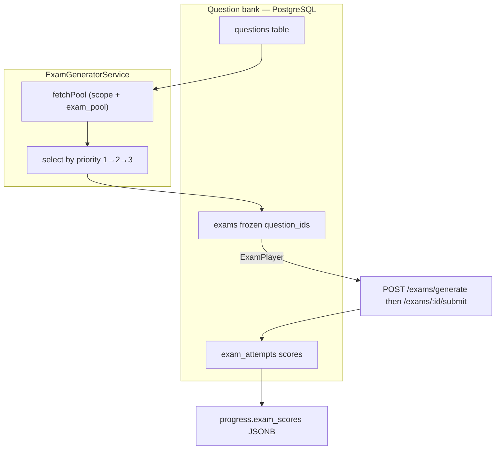
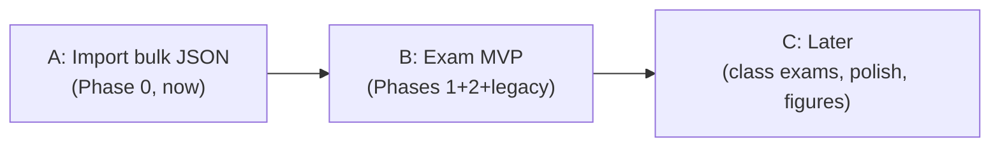
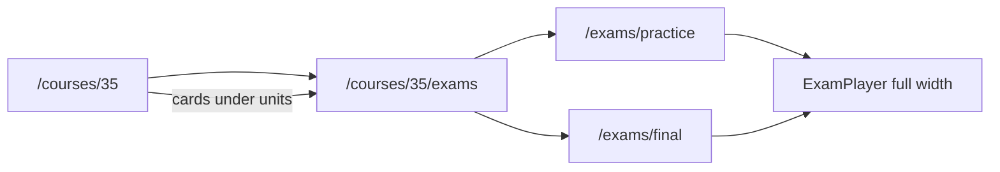

# Exam generator, question bank, and course linking

Implementation planning document for quizzes/practice exams, end-of-course finals, and class-assigned exams. Summarizes **how the system works today**, **known gaps**, and a **pre-launch implementation plan**: import question data early (Bundle A), then ship generator + student UI + legacy removal together (Bundle B), defer class exams and polish (Bundle C).

**Related docs**

| Doc | Purpose |
| --- | --- |
| [`features.md`](./features.md) | Product capabilities and school positioning |
| [`backend-data.md`](./backend-data.md) | API routes and entity overview |
| [`course-editing-roadmap.md`](./course-editing-roadmap.md) | Course payload authoring |
| [`../assets/articles/faa_107_questions_gaps.md`](../assets/articles/faa_107_questions_gaps.md) | Part 107 import stats, sub-unit coverage, import risks |
| [`../assets/articles/faa_107_general_operations_review.csv`](../assets/articles/faa_107_general_operations_review.csv) | 167 rows: spreadsheet K/L cleanup for content team |
| [`../scripts/build_faa_107_questions.py`](../scripts/build_faa_107_questions.py) | Bulk JSON builder from Testing CSVs |
| [`../scripts/export_general_operations_review.py`](../scripts/export_general_operations_review.py) | Regenerate general-operations review export |

**Primary code**

| Area | Path |
| --- | --- |
| Exam generation | `backend/src/questions/exam-generator.service.ts` |
| Exam API | `backend/src/questions/exam.controller.ts` |
| Attempt scoring | `backend/src/questions/exam-attempt.service.ts` |
| Question bank CRUD / import | `backend/src/questions/question.controller.ts`, `question.service.ts` |
| Entities / DTOs | `backend/src/questions/types/*.entity.ts`, `question.dto.ts` |
| Student practice UI | `drone/src/app/ui/components/exam-player.tsx` |
| Course overview (exams in sidebar today) | `drone/src/app/ui/components/course.tsx` |
| Course exam pages (planned §4.4) | `drone/src/app/courses/[courseId]/exams/…` |
| ~~Legacy unit exam UI~~ | Removed in Bundle B |
| Manager class exams | `drone/src/app/manager/page.tsx` (Exams tab) |
| Admin question bank | `drone/src/app/ui/components/question-bank-editor.tsx` |

---

## 1. Architecture overview

All assessments use the **question bank** path. The legacy embedded-exam path was removed in Bundle B.



### 1.1 Course structure (content linker)

Course outline lives in **`courses.payload`** (`CourseDetails` JSON), e.g. `assets/articles/faa_107_course.json` for Part 107 (course id **35**).

| Level | ID pattern | Example |
| --- | --- | --- |
| Unit | `1`–`9` | Unit 5 = Weather, Unit 6 = Weather effects |
| Sub-unit | `unit * 10 + n` | `51`–`55` under Unit 5 |
| Sub-sub-unit | `unit * 100 + …` | `531`–`534` under METAR decoding |

Questions in the bank link via **`course_id`**, **`unit_id`**, **`sub_unit_id`** (nullable). There is **no foreign key** to the JSON payload—IDs must match by convention.

### 1.2 Question bank (assessment linker)

| Field | Purpose |
| --- | --- |
| `course_id` | Required; all questions for a course |
| `unit_id` / `sub_unit_id` | Scopes questions to unit/sub-unit quizzes; `null` = course-wide only |
| `choices` | JSONB `[{id, text, is_correct}]` — exactly one correct |
| `priority` | `1` core, `2` standard, `3` supplemental (selection order) |
| `difficulty` | `easy` \| `medium` \| `hard` |
| `standard` | Optional tag (e.g. ACS code); also used for **`FINAL_EXAM`** |
| `status` | `active` \| `draft` \| `archived` |

**Bulk import:** `POST /questions/import` with body `{ course_id, questions: [...] }`. Export: `GET /questions/export?courseId=`. See `BulkImportDto` in `question.dto.ts`.

**Part 107 import artifact:** `assets/articles/faa_107_questions.bulk.json` (461 unique questions from Testing CSVs). Regenerate with `python3 scripts/build_faa_107_questions.py`.

### 1.3 Exam scopes

| `scope` | `scope_ids` | Pool query (today) |
| --- | --- | --- |
| `sub_unit` | e.g. `[531]` | `sub_unit_id = ANY(scope_ids)`, `status = active` |
| `unit` | e.g. `[5]` | `unit_id = ANY(scope_ids)`, `status = active` |
| `full_course` | `[]` | All active questions for `course_id` (no unit filter) |

**Selection:** Core (`priority=1`) always included first, then standard, then supplemental until `question_count` is met—or entire pool if `question_count` omitted.

---

## 2. What works today

### Backend

- Question CRUD, bulk import/export, archive (soft delete).
- `ExamGeneratorService.generate` (student) and `generateClassExam` (manager/org).
- Fixed exams deduplicated via `dedup_key` on `exams` table.
- Attempt scoring, section breakdown by `unit_id` / `sub_unit_id`, progress snapshot (`exam_scores`, `latest_exam_score` for `full_course`).
- Choices hidden from client until submit (`is_correct` stripped in `buildExamWithQuestions`).

### Frontend

- **`ExamPlayer`** on unit pages (`scope: unit`), leaf sub-unit sections (`scope: sub_unit`), and **course overview** (`full_course` practice + final).
- **`exam_pool`** on generate: `scoped` (default), `final_only`, `all`.
- **Course exams placement (today):** Both full-course players live in the **right sidebar** (`course.tsx`, `lg:grid-cols-3` → sidebar ≈ **33% width**). Idle state is a single horizontal row (icon + text + button); **taking/results** expand to 60 questions inside that column — cramped on desktop and worse on mobile. See **§4.4** for planned layout fix.
- **Manager Exams tab:** create class exams (`full_course` / `unit` / `sub_unit`), optional `question_count`, view org results.
- **Admin `QuestionBankEditor`:** manual edit + JSON import (`replace_existing` supported).

### Part 107 import conventions (builder script)

| Tag / rule | Meaning |
| --- | --- |
| `standard = "FINAL_EXAM"` | End-of-course / figure-heavy; import sets `unit_id` and `sub_unit_id` to **null** |
| `priority = 3` | Supplemental tier for generated exams |
| `difficulty = hard` | When stem references FAA-CT figure |
| `topical_unit_id` in review CSV | Human-readable unit before FINAL_EXAM nulling |

**Effect without API changes:** `FINAL_EXAM` questions (`unit_id=null`) are **excluded** from unit/sub-unit `fetchPool` queries. They only appear in `full_course` pools.

---

## 3. Current gaps

Gaps are ordered by impact on shipping a credible Part 107 practice + final exam experience.

### 3.1 Critical — blocks end-of-course and class exams

| # | Gap | Detail |
| --- | --- | --- |
| G1 | ~~No student full-course exam UI~~ | **Resolved (Bundle B).** `ExamPlayer` on `course.tsx` with practice + final. **Remaining:** layout too narrow — see **G19**. |
| G2 | **No student class-exam flow** | Managers can assign exams via `POST /exams/class`; students cannot list or open assigned exams. `getExamWithQuestions` exists in api-client but is unused on learner routes. |
| G3 | ~~`FINAL_EXAM` not interpreted by API~~ | **Resolved (Bundle B).** `exam_pool`: `scoped` / `final_only` / `all`. |
| G4 | ~~`question_count` not hard-capped~~ | **Resolved (Bundle B).** `selectQuestions` caps all priority groups + final `slice`. |

### 3.2 High — quality and linker integrity

| # | Gap | Detail |
| --- | --- | --- |
| G5 | ~~Dual exam systems~~ | **Resolved (Bundle B).** Legacy `ExamComponent` and unit exam submit removed. |
| G6 | **No course-ID validation on import** | `unit_id` / `sub_unit_id` not verified against `courses.payload`. Typos silently create empty scoped exams. |
| G7 | **Many sub-units have zero questions** | See `faa_107_questions_gaps.md`. Sub-unit scoped quizzes can return empty pools. |
| G8 | **Section breakdown uses numeric IDs** | Results show “Unit 5 · Section 531”, not titles from course JSON. |
| G9 | **No explanations after submit** | `explanation` on questions is not returned in attempt results; review mode is weaker than it could be. |

### 3.3 Medium — figure / chart questions

| # | Gap | Detail |
| --- | --- | --- |
| G10 | **No figure embedding** | ~77 questions require FAA-CT-8080-2H figures. Stems say “Refer to Figure N”; app cannot display charts. **Accepted for now:** students use the book; track TODO for online figure viewer or separate tab. |
| G11 | **Figure typos in source** | Some stems reference `8080-2G`, `800-2H` instead of `8080-2H`. Fix in source CSV or import normalization. |

### 3.4 Medium — generator features

| # | Gap | Detail |
| --- | --- | --- |
| G12 | **No difficulty filter** | Cannot request “medium only” for unit quizzes or “hard only” for finals at API level. |
| G13 | **Unit scope does not explicitly include “unit-level only” questions** | Query is `unit_id = X` (includes all sub-units under that unit if `unit_id` is set). Questions with **only** `sub_unit_id` and null `unit_id` would be missed—import should always set `unit_id` when sub_unit is set. |
| G14 | **`FINAL_EXAM` breakdown shows as Unit 0** | `buildBreakdown` uses `unit_id ?? 0` for null unit questions in a mixed exam. |

### 3.5 Lower — data and ops

| # | Gap | Detail |
| --- | --- | --- |
| G15 | **Question bank not uploaded until import run** | Course content and questions are separate; production DB may be empty until `POST /questions/import`. |
| G16 | **461 vs 491 legacy count** | Testing CSVs dedupe to 461 unique rows (~152 duplicates dropped vs old workbook). |
| G17 | **Spreadsheet mapping conflicts** | `Operations / General operations` vs `Category` disagree on many rows; classifier mitigates but review CSV worth spot-check. |
| G18 | **Unit 8 (Emergency) thin** | Only a handful of quiz-scoped emergency questions. |
| G19 | ~~Course exams cramped in sidebar~~ | **Resolved (UX-1+2).** Exams on main column + `/courses/[id]/exams/*` routes. |

---

## 4. Implementation plan (pre-launch)

**Context:** The site is **not live yet**, so we can compress the original six phases into fewer bundles. Import question data early (it unlocks unit quizzes immediately). Ship generator + student UI + legacy removal in **one MVP PR** rather than staggered half-features.

### 4.0 Data readiness (`faa_107_questions.bulk.json`)

Built from combined Testing CSVs (`test.csv` + `end of unit questions.csv`):

| Metric | Value |
| --- | ---: |
| Unique questions | **461** |
| Duplicates dropped (vs raw rows) | 152 |
| `FINAL_EXAM` (null `unit_id`, full-course only) | 77 |
| Quiz-scoped by unit | U1:122, U2:27, U3:25, U4:49, U5:20, U6:100, U7:17, U8:3, U9:21 |
| Draft (needs content fix) | 1 |

Regenerate after CSV or course JSON changes:

```bash
python3 scripts/build_faa_107_questions.py
```

Spreadsheet K/L fixes (`faa_107_general_operations_review.csv`) do **not** change bulk JSON until the source CSVs are updated and the build script is re-run.

---

### 4.1 Recommended bundles (not live)



| Bundle | Original phases | When | Rationale |
| --- | --- | --- | --- |
| **A — Import** | 0 | **Now**, separate from code | Additive, no API changes; `ExamPlayer` on units works as soon as DB has rows |
| **B — Exam MVP** | 1 + 2 + legacy removal | **One PR** | Avoid shipping `exam_pool` without UI, or final UI without pool filtering |
| **C — Post-launch** | 3, 4, 5 | Defer | Class exams, results polish, figure viewer — not blocking first student experience |

**Do not** treat legacy exam removal as a late “Phase 6” for this project: `faa_107_course.json` has no `unit.exam` blocks, and no other course JSON in the repo embeds exams. Remove `ExamComponent`, `exam.tsx`, and `POST .../units/:unitId/exam/submit` as part of Bundle B.

---

### 4.2 Backward compatibility

| Change | Compatible? | Notes |
| --- | --- | --- |
| Bulk import (`POST /questions/import`) | **Yes** | New tables only; course payload unchanged. Re-import with `id` from export updates existing rows |
| `exam_pool` on `POST /exams/generate` | **Yes** | Optional field; omit = current behavior |
| Remove legacy embedded exams | **Yes (today)** | No course content uses `unit.exam`. Only risk: old **dev/staging** `progress` blobs that stored scores via legacy submit |
| Class exams (Bundle C) | N/A until built | Manager UI already creates exams; student take flow still missing |

---

### 4.3 Deploy sequence

1. Run DB migrations (`questions`, `exams`, `exam_attempts`).
2. Deploy backend.
3. **Bundle A:** Import `assets/articles/faa_107_questions.bulk.json` (admin UI or API).
4. Deploy frontend with Bundle B (generator + course exam UI + legacy removal).
5. Smoke-test (see §6).

---

### Phase 0 — Data import (Bundle A)

**Goal:** Question bank populated for course 35. Can run **before** Bundle B code ships.

| Task | Owner | Notes |
| --- | --- | --- |
| Upload `faa_107_questions.bulk.json` via Admin import or `POST /questions/import` | Ops / Admin | ~460 active + 1 draft |
| Confirm course JSON in DB matches `faa_107_course.json` (units 5 & 6 present) | Ops | |
| Spot-check `faa_107_questions_review.csv` | Content | Optional before import; classifier already routes most rows |
| Share `faa_107_general_operations_review.csv` with content team | Content | Fix spreadsheet columns K/L (see review MD) |
| Fix or activate the one `draft` question | Content | Rebuild + re-import after fix |

**Acceptance:** `GET /questions?courseId=35` returns ~461 questions. Unit/sub-unit `ExamPlayer` quizzes return questions (empty pools only where gap report shows zero questions).

**Immediate value without Bundle B:** Students can take **unit** and **sub-unit** practice exams via existing `ExamPlayer` on unit/section pages.

---

### Phase 1 — Generator correctness (Bundle B, backend)

**Goal:** Exam API supports final vs practice pools and respects `question_count`.

| Task | Addresses | Implementation notes |
| --- | --- | --- |
| Add `exam_pool?: 'all' \| 'scoped' \| 'final_only'` to `GenerateExamDto` | G3 | `final_only` → `AND standard = 'FINAL_EXAM'`; optional `scoped` excludes `FINAL_EXAM` for `full_course` |
| Enforce `question_count` cap after priority merge | G4 | Cap **core** group too: `return selected.slice(0, targetCount)` (today core is uncapped and can blow past `question_count`) |
| Optional: `exclude_standards?: string[]` | G3, G12 | Future-proof |
| Unit/sub_unit pools: optionally `AND (standard IS NULL OR standard != 'FINAL_EXAM')` | G3 | Belt-and-suspenders beyond `unit_id=null` |
| API tests for pool sizes per scope + exam_pool | — | `backend/test/` |

**Acceptance:**

- `full_course` + `final_only` returns only `FINAL_EXAM` questions (~77).
- `full_course` + default returns non–final-only or all per product choice.
- `question_count: 20` never returns more than 20 questions.

---

### Phase 2 — Student practice and final exams (Bundle B, frontend)

**Goal:** Learners can run unit quizzes and a course final from the UI.

| Task | Addresses | Implementation notes |
| --- | --- | --- |
| Add `ExamPlayer` to course page with `scope: full_course` | G1 | Two buttons: “Practice exam (all topics)” vs “Final exam (charts)” using `exam_pool` |
| Pass `question_count` (e.g. 40–60) for finals | G4 | Product decision on length |
| Show empty-state copy when pool is empty | G7 | Link to admin/content |
| Expose `exam_pool` on `GenerateExamPayload` in `api-client` / types | G3 | |

**Acceptance:** Logged-in student with course access can generate and submit unit, sub-unit, and full-course exams from the app.

---

### Legacy exam removal (Bundle B, same PR as Phases 1–2)

**Goal:** Single assessment path via question bank + `exam_attempts`.

| Task | Addresses | Notes |
| --- | --- | --- |
| Remove `ExamComponent` from `unit.tsx` and `section.tsx` | G5 | Keep `ExamPlayer` only |
| Delete or archive `drone/src/app/ui/components/exam.tsx` | G5 | |
| Remove `POST /courses/:courseId/units/:unitId/exam/submit` and related progress mutation | G5 | |
| Trim progress/course-progress code that only serves embedded `unit.exam` | G5 | Retain `exam_attempts` → `progress.exam_scores` path |

**Acceptance:** No UI or API path reads `unit.exam` from course JSON. Part 107 course page + units use question bank only.

---

### 4.4 Course exam UX — layout and navigation (planned)

**Problem:** Bundle B mounted two `ExamPlayer` instances (`scoped` practice + `final_only`) at the bottom of the course **sidebar** in `drone/src/app/ui/components/course.tsx`. The grid is `lg:grid-cols-3` (main 2/3, sidebar 1/3). For a 60-question exam, the player’s taking and results phases need full-width question cards, progress, and review — the sidebar feels “very thin” and is easy to miss below the unit link list.

**Goals for test takers**

- Discover **practice exam** vs **charts/final exam** without scrolling a narrow column.
- Take and review exams with **readable line length** (match unit page / `max-w-4xl` content width).
- **Bookmarkable** URLs for “I’m doing my final today” (optional but high value).
- Show **last score** when returning (reuse `progress.latest_exam_score` / `exam_scores` where available).

**Backend for core flow (UX-1 + UX-2):** None required — `POST /exams/generate` and `POST /exams/:id/submit` already enforce JWT + `assertCourseAccess(course_id)`. Optional backend work unlocks **last scores on hub** (UX-3) and fixes **practice vs final score conflation** (see risks below).

#### Option A — Wider block on course page (quick win)

Move “Course exams” out of the sidebar into the **main column**, directly **under the unit preview list** (still on `/courses/[courseId]`).

| Approach | Layout | Effort |
| --- | --- | --- |
| **A1 — Main column section** | Remove `ExamPlayer` from sidebar; add a full-width `col-span-2` section below unit cards with heading + two exam cards side-by-side (`sm:grid-cols-2`). | Small |
| **A2 — Full-width row below grid** | Keep sidebar for Info + unit nav only; add a second row spanning all columns under the 3-col grid for exams. | Small |

**Pros:** One page, no new routes, immediate width fix.  
**Cons:** Long exam still scrolls within course page; URL not shareable; browser back leaves mid-exam unless we warn.

**Files:** `course.tsx` only (optional `course-exams-section.tsx` extract).

#### Option B — Dedicated exam page (recommended for finals)

Add navigable routes that host `ExamPlayer` at **full content width** (`max-w-4xl` centered, same as unit pages).

| Route | Purpose | `ExamPlayer` props |
| --- | --- | --- |
| `/courses/[courseId]/exams` | Hub: choose practice vs final, show last scores, links to units | No player — cards only |
| `/courses/[courseId]/exams/practice` | Full-course practice | `scope=full_course`, `exam_pool=scoped`, `questionCount=60` |
| `/courses/[courseId]/exams/final` | Charts / cross-section final | `scope=full_course`, `exam_pool=final_only`, `questionCount=60` |

Optional query param later: `?retake=1` (same as clicking Retake in player).

**Pros:** Bookmarkable, clear mental model, best UX for 60-question sessions, room for hub copy (book reminder for final).  
**Cons:** New pages + breadcrumbs; must gate with `has_access` / `AuthGuard` like course page.

**Files (new):**

- `drone/src/app/courses/[courseId]/exams/page.tsx` — hub
- `drone/src/app/courses/[courseId]/exams/practice/page.tsx`
- `drone/src/app/courses/[courseId]/exams/final/page.tsx`
- `drone/src/app/ui/components/course-exam-hub.tsx` (optional)
- `drone/src/app/ui/components/course-exams-nav.tsx` — sidebar links → hub

**Reuse:** `exam-player.tsx` unchanged; pass `layout="full"` prop later only if we want compact idle on hub vs wide on take (optional polish).

#### Option C — Hybrid (recommended overall)

Combine **A1/A2** discovery on the course page with **Option B** for the actual exam session.

1. **Course page:** Prominent “Course exams” block under units (two large cards + short descriptions). Buttons link to `/exams/practice` and `/exams/final` — do **not** embed full `ExamPlayer` in sidebar.
2. **Exam hub** (`/exams`): Repeat cards + last attempt summary if we expose scores on course/progress API.
3. **Practice / final pages:** Full-width `ExamPlayer`; breadcrumb: Course → Exams → Practice (or Final).



#### UI component tweaks (any option)

| Task | Notes |
| --- | --- |
| `ExamPlayer` `variant?: 'inline' \| 'page'` | **Done** — `page`: centered idle CTA, progress bar, sticky submit footer, “Back to exams” on results. |
| `CourseExamCard` | Shared card: title, description, question count, CTA link/button, last score badge. |
| Sidebar on course | **Done** — single “Exams” link → hub (cards remain primary discovery). |
| Mobile | Stack cards vertically; exam take phase already single column. |

#### Progress / “savable” scores

| Data | Today | Plan |
| --- | --- | --- |
| Attempt storage | `exam_attempts` + upsert per user/exam | No change |
| Course progress | `progress.latest_exam_score` (full_course), `progress.exam_scores[]` | Show on exam **hub** if `getCourseById` or progress endpoint exposes them; else add `GET /progress/courses/:courseId` slice (small backend task) |
| URL | Course page only | `/courses/35/exams/final` bookmarkable |

Returning users: hub shows “Last practice: 82%” / “Last final: 71%” from latest snapshot in `exam_scores` filtered by scope/pool (may need client-side filter by exam metadata or extend snapshot with `exam_pool` label).

#### UX-1 — Course page discovery (detailed)

**Goal:** Students see practice vs final **before** leaving the course page; sidebar no longer hosts `ExamPlayer`.

| Task | Detail |
| --- | --- |
| Remove sidebar `ExamPlayer` | Delete both instances from `course.tsx` (lines ~104–127 today). |
| Add `CourseExamsSection` | New component under the **unit preview list** in the main column (`lg:col-span-2`), after the last `UnitPreviewComponent`. |
| Two `CourseExamCard`s | Side-by-side on `sm+` (`grid sm:grid-cols-2 gap-4`), stacked on mobile. Each card: title, 1–2 sentence description, “60 questions”, primary CTA **link** (not inline player). |
| Practice card | Title: “Full-course practice exam”. Copy: excludes chart-only final items. Link: `/courses/{id}/exams/practice`. |
| Final card | Title: “Charts & figures final”. Copy: FAA-CT-8080-2H supplement required. Link: `/courses/{id}/exams/final`. |
| Sidebar shortcut (optional) | Under “Units” in sidebar, add two text links: “Practice exam →”, “Final exam →” pointing to same routes (helps users who scroll the nav column only). |
| Access gate | Wrap section in `has_access !== false` (same as today). No purchase flow on exam routes without access — pages should redirect or show purchase CTA. |
| Analytics (optional) | `trackEvent` on card click → practice vs final (reuse course view patterns in `lib/analytics.ts`). |

**Files**

| File | Change |
| --- | --- |
| `drone/src/app/ui/components/course.tsx` | Remove sidebar players; render `CourseExamsSection` in main column |
| `drone/src/app/ui/components/course-exams-section.tsx` | **New** — section + cards |
| `drone/src/app/ui/components/course-exam-card.tsx` | **New** — reusable card (used again on hub in UX-2) |

**Depends on:** UX-2 routes existing (or ship UX-1 + UX-2 in one PR so links are not 404).

**Acceptance**

- [ ] No `ExamPlayer` in the 1/3 sidebar column.
- [ ] “Course exams” visible below unit cards at ~66% page width (main column).
- [ ] Both CTAs navigate to dedicated exam URLs (not `#` anchors).
- [ ] Section hidden when `has_access === false`.

**Backend:** None.

---

#### UX-2 — Dedicated exam routes (detailed)

**Goal:** Bookmarkable, full-width exam sessions; optional hub for orientation and (later) scores.

##### Routes and pages

| Route | Page file | Responsibility |
| --- | --- | --- |
| `/courses/[courseId]/exams` | `exams/page.tsx` | **Hub** — course title, two cards (reuse `CourseExamCard`), breadcrumb, links back to course |
| `/courses/[courseId]/exams/practice` | `exams/practice/page.tsx` | Full-width `ExamPlayer` (`scoped`, 60 Q) |
| `/courses/[courseId]/exams/final` | `exams/final/page.tsx` | Full-width `ExamPlayer` (`final_only`, 60 Q) |

**Layout pattern** (match unit pages):

```tsx
// Wrapper: max-w-4xl mx-auto px-4 py-12, AuthGuard, fetch course for title + has_access
<nav breadcrumb> Course → Exams → Practice </nav>
<h1>Full-course practice exam</h1>
<ExamPlayer courseId={…} scope="full_course" examPool="scoped" questionCount={60} showTopBorder={false} />
```

| Concern | Approach |
| --- | --- |
| Auth | Wrap each page with `AuthGuard` (same as `courses/[courseId]/page.tsx`). |
| Course context | `getCourseById(courseId)` on mount — verify course exists; read `has_access`, `title` for breadcrumb. |
| No access | If `has_access === false` and paid course → render `PurchaseFlow` or redirect to `/courses/[courseId]` (match course page behavior). |
| Loading / error | Reuse `LoadingComponent` / `ErrorComponent`. |
| SEO | Add `layout.tsx` under `exams/` with `metadata` title template: “Practice exam — {course}” (optional). |
| `beforeunload` | Optional: warn on practice/final pages when `phase === 'taking'` (browser tab close) — not in MVP unless easy. |

##### `ExamPlayer` on dedicated pages

- Container: parent provides `max-w-4xl`; player uses full width of container.
- Optional prop `variant="page"` (UX-3): slightly larger typography, sticky footer for Submit on long exams — **not required for UX-2**.
- **Do not** mount two players on one route; one pool per URL keeps URLs stable and shareable.

##### Hub vs skip hub

| Approach | When |
| --- | --- |
| **With hub** (`/exams`) | Recommended — neutral landing, room for last scores (UX-3), “which exam am I taking?” |
| **Skip hub** | Course cards link directly to `/practice` and `/final`; hub route optional redirect to course |

**Acceptance**

- [ ] `/courses/35/exams/practice` and `/final` render at content width (~896px), not sidebar width.
- [ ] User can generate, answer all questions, submit, see results, retake.
- [ ] Breadcrumb returns to `/courses/35` and `/courses/35/exams`.
- [ ] Direct URL works when logged in with access; 403 from API if no access.
- [ ] Invalid `courseId` → course not found UI.

**Backend:** None for generate/submit (already gated). See **§4.4 Backend support** for score display.

---

#### Backend support for Option C

| Capability | UX-1 | UX-2 | UX-3 / polish | Status today |
| --- | --- | --- | --- | --- |
| Generate exam | — | ✓ | ✓ | `POST /exams/generate` + `assertCourseAccess` |
| Submit attempt | — | ✓ | ✓ | `POST /exams/:id/submit` |
| Course `has_access` on page | ✓ | ✓ | ✓ | `GET /courses/:id` via `getCourseWithProgress` |
| `latest_exam_score` on course JSON | — | — | ✓ | **Not returned** to frontend in `CourseDetails` |
| `exam_scores[]` on course JSON | — | — | ✓ | **Not returned** — only in DB on `progress` row |
| Distinguish practice vs final in progress | — | — | ✓ | **Gap** — see risks |
| Progress row before first exam | — | ✓ | ✓ | Snapshot skipped if no `progress` row yet |
| List attempts by course | — | — | Optional | No `GET /exams/attempts?courseId=` |

##### Recommended backend additions (prioritized)

**P0 — None** for shipping UX-1 + UX-2 (layout + routes only).

**P1 — Last scores on hub (UX-3)** — pick one:

| Option | Work | Pros |
| --- | --- | --- |
| **B1 — Extend course GET** | Add optional fields on `CourseDetails` when user has access: `latest_exam_score`, `exam_scores` (or slim DTO). Merge from `progress` in `CourseProgressService.getCourseWithProgress`. | One request already used by pages |
| **B2 — Progress endpoint** | `GET /progress/courses/:courseId/summary` → `{ latest_exam_score, exam_summaries: [{ kind: 'practice' \| 'final', score, taken_at }] }` | Keeps course payload small |

**P2 — Fix practice vs final score tracking** (needed if hub shows both scores correctly):

Today `ExamScoreSnapshot` stores `exam_id`, `scope`, `scope_ids`, `score`, `taken_at` — **not** `exam_pool`. `exams` table also has **no** `exam_pool` column (pool is only on the generate DTO). Effects:

- `progress.latest_exam_score` is updated for **any** `full_course` submit — practice overwrites final and vice versa.
- `exam_scores[]` is keyed by `exam_id`; each retake creates a **new** exam row → multiple snapshots; no stable “last practice” vs “last final” without pool metadata.

| Fix | Migration | Behavior |
| --- | --- | --- |
| **B3a — Add `exam_pool` to `exams`** | `varchar` nullable, set in `saveExam` from DTO | Snapshots can copy pool from exam row; filter hub scores |
| **B3b — Add `exam_pool` to `ExamScoreSnapshot` only** | JSONB shape change | Set in `updateProgressExamScores` from generate DTO passed through submit path (requires threading pool at submit time via exam row or attempt) |
| **B3c — Denormalized columns on progress** | `latest_practice_score`, `latest_final_score` + timestamps | Simplest read model; update rules in `exam-attempt.service` |

**Recommendation:** **B1 + B3a** (expose progress on course GET; persist `exam_pool` on `exams` and snapshot) — one migration, clear hub UI.

**P3 — Ensure progress exists before exam** (optional):

- On `POST /exams/generate`, call `getOrCreateProgress(userId, courseId)` so `exam_scores` updates always apply (today: skip if no row).

##### Frontend types (when B1 lands)

```typescript
// course.ts
exam_summary?: {
  practice?: { score: number; taken_at: string } | null;
  final?: { score: number; taken_at: string } | null;
};
```

---

#### Risks and known limitations

**Resolved risks** (from planning phase):

| Risk | Resolution |
| --- | --- |
| ~~UX-1 links 404 if split PRs~~ | Shipped UX-1 + UX-2 together |
| ~~`latest_exam_score` conflates practice + final~~ | `exam_pool` on exams + `buildExamSummary` filters by pool; UI reads `exam_summary`, not `latest_exam_score` |
| ~~No progress row → scores not saved~~ | `ensureProgress` on `POST /exams/generate` |
| ~~Paid course / no access on exam pages~~ | `CourseExamPageShell` mirrors purchase gate via `getCourseById` + `has_access` check; API returns 403 |
| ~~Exam before course visit~~ | Same as above — `ensureProgress` creates progress row on generate |
| ~~Retake = new exam id~~ | Expected for randomized exams; `exam_summary` uses latest snapshot by pool, not single `exam_id` |
| ~~Mobile sidebar~~ | Main-column cards stack; exam take phase is single-column; sidebar consolidated to one link |

**Active risks** (post-implementation review, May 2026):

| # | Risk | Severity | Status | Resolution |
| --- | --- | --- | --- | --- |
| R1 | **`latest_exam_score` overwritten by practice** | Low | **Fixed** | Only writes `latest_exam_score` when `exam_pool === 'final_only'`. Practice exams no longer clobber the field. |
| R2 | **No `beforeunload` on exam pages** | Low–Med | **Fixed** | `ExamPlayer` registers a `beforeunload` handler during the `taking` phase. Browser shows a native "Leave page?" dialog on tab close / navigation. |
| R3 | **New exam row per generate (no reuse)** | Low | **Fixed** | `exam-generator.service.ts` now checks for the user's most recent unattempted exam (same scope + pool) and reuses it instead of creating a new row. |
| R4 | **`exam_scores` JSONB growth on progress** | Low | **Fixed** | `updateProgressExamScores` caps entries to 10 per (scope, exam_pool, scope_ids) group, sorted by `taken_at` descending. Prevents unbounded JSONB growth. |
| R5 | **Stripe SDK loaded on every exam page** | Low | **Fixed** | Removed `loadStripe` / `<Elements>` from `CourseExamPageShell`. If user lacks access, redirects to `/courses/:id` (where the purchase flow lives). |
| R6 | **Review cannot show correct answer** | Medium | **Fixed** | Backend now returns `correct_choice_id` and `explanation` on each scored answer in `ExamAttemptResultDto`. Frontend highlights the correct choice with a green checkmark and shows an explanation card for wrong answers. |
| R7 | **Exam hub has no purchase gate** | Low | **Fixed** | `exams/page.tsx` checks `has_access`; redirects to `/courses/:id` if the user hasn't purchased. |
| R8 | **Mid-exam answer loss on navigation** | Medium | **Fixed** | Answers are persisted to `sessionStorage` (keyed by exam ID) on every selection change. On generate, if a draft exists for the (reused) exam, answers are restored. Cleared on submit or retake. |
| R9 | **Figure questions without book** | Low | **Fixed** | Added `figure_ref` column to `questions` (migration `1745100005000`). When set, `ExamPlayer` shows an "FAA Figure N" link pointing to the official FAA-CT-8080-2H PDF. Admin can populate via import/update DTOs. |
| R10 | **Analytics funnel not tracked** | Low | **Fixed** | Added `sendExamEvent` helper to `analytics.ts`. `ExamPlayer` fires `exam_start` on generate and `exam_submit` (with score) on successful submission. |
| R11 | **Accessibility gaps** | Medium | **Fixed** | Submit button has `aria-disabled`. Remaining-questions count uses `aria-live="polite"`. Progress bar has `aria-label`. Question list uses `role="list"` / `role="listitem"`. Radio groups wrapped in `<fieldset>` + `<legend class="sr-only">`. Error messages use `role="alert"`. |
| R12 | **SEO / sitemap** | Low | **Verified** | Exam routes are behind auth + `robots: noindex`. `sitemap.ts` does not include exam URLs. No change needed. |
| R13 | **i18n** | Low | Deferred | All exam UI strings are English-only. Not blocking until multi-language is prioritized. |
| R14 | **Class exams (G2)** | Future | Deferred | Backend ready (`ClassExam` entity, endpoints). No student-facing UI yet. Needs `/courses/[id]/exams/assigned/[classExamId]` route. |

**Option C completion checklist:**

| Item | Status | Notes |
| --- | --- | --- |
| `CourseExamCard` component | **Done** | Shared hub + course section |
| `CourseExamsSection` under units | **Done** | Main column, `id="course-exams"` anchor |
| Breadcrumbs component | **Done** | `CourseExamBreadcrumb` |
| `exams/layout.tsx` metadata | **Done** | `noindex` robots |
| Purchase gate on exam routes | **Done** | `CourseExamPageShell` mirrors course page |
| Sidebar consolidated | **Done** | Single "Exams" link → hub (replaced 3-link block) |
| Hub route `/exams` | **Done** | Refetches on window focus for fresh scores |
| `exam_pool` on `exams` table | **Done** | Migration `1745100004000` |
| `exam_summary` on course GET | **Done** | `buildExamSummary` in `course-progress.service.ts` |
| `ensureProgress` on generate | **Done** | `exam.controller.ts` calls before generate |
| `ExamPlayer variant="page"` | **Done** | Sticky submit footer, progress bar, centered idle CTA, "Back to exams" on results |
| FAA-CT callout on final page | **Done** | Amber callout above `ExamPlayer` on `final/page.tsx` |
| `sessionStorage` draft + restore | **Done** | R2/R8 — answers persisted per exam ID; restored on reuse |
| `beforeunload` warning | **Done** | R2 — browser prompt on tab close during exam |
| Correct answer + explanation in review | **Done** | R6 — `correct_choice_id` + `explanation` in result; green highlight + card |
| `figure_ref` on questions | **Done** | R9 — column + migration + PDF link in player |
| Exam analytics events | **Done** | R10 — `exam_start` + `exam_submit` via `sendExamEvent` |
| ARIA accessibility pass | **Done** | R11 — `aria-disabled`, `aria-live`, `fieldset`/`legend`, `role="alert"` |
| Stripe removed from exam shell | **Done** | R5 — redirect to course page for purchase |
| Exam reuse on generate | **Done** | R3 — reuses unattempted exam for same user+scope+pool |
| `exam_scores` capped at 10/group | **Done** | R4 — prevents JSONB bloat |
| E2E test: practice flow | Not started | Smoke-test path documented in §6 |

---

#### Recommended phasing (updated)

| Phase | Deliverable | Backend | Bundle |
| --- | --- | --- | --- |
| **UX-1** | `CourseExamsSection` + cards under units; remove sidebar players; sidebar links optional | None | Small PR (with UX-2) |
| **UX-2** | `/exams`, `/exams/practice`, `/exams/final`, AuthGuard, breadcrumbs, `getCourseById` gate | None | Same PR as UX-1 |
| **UX-3** | Hub last scores; `ExamPlayer variant="page"`; FAA-CT callout on final | **B1 + B3a** (recommended) | Bundle C / follow-up |
| **UX-3b** | `getOrCreateProgress` on generate | **P3** | Small, can ship with UX-3 |

**Acceptance (UX-1 + UX-2):**

- Course page clearly surfaces practice vs final without using sidebar width for 60-question UI.
- Practice and final open on dedicated URLs at content width.
- Logged-in user with course access can complete and submit; back link returns to course or exam hub.
- No regression on unit/sub-unit `ExamPlayer` on unit and section pages.

**Acceptance (UX-3):**

- Hub shows separate last practice and last final scores (after backend P1 + P3a).
- Scores update after submit without requiring a full course page reload (refetch course or progress summary).

#### Open choice (record in §7)

| Decision | Options |
| --- | --- |
| Course exam layout | Sidebar only / Main column embed / **Hybrid (cards on course + dedicated pages)** ← recommended |
| Exam hub route | Single `/exams` hub vs direct links only from course |
| Show last score on hub | Yes (needs progress on course API) / defer |

---

### Phase 3 — Class-assigned exams (Bundle C, deferred)

**Goal:** Manager-assigned exams are takable by org members.

| Task | Addresses | Implementation notes |
| --- | --- | --- |
| `GET /exams/class/assigned` (or include in org dashboard) for current user | G2 | List open class exams with `exam_id`, label, due_date |
| Student page or course banner: “Assigned exam: …” → `getExamWithQuestions(exam_id)` | G2 | Reuse `ExamPlayer` in “assigned” mode (no regenerate) |
| Submit via existing `POST /exams/:examId/submit` | G2 | |

**Acceptance:** Manager creates class exam; student in org sees it, takes it, score appears in manager results.

---

### Phase 4 — Results and instructional polish (Bundle C, deferred)

| Task | Addresses | Status | Notes |
| --- | --- | --- | --- |
| Return `explanation` + `correct_choice_id` in attempt result | G9 | **Done (R6)** | `ExamAttemptResultDto` includes both; player shows green highlight + explanation card |
| Resolve unit/sub-unit titles in breakdown from course payload | G8 | Deferred | Pass course outline to player or enrich breakdown server-side |
| Label `FINAL_EXAM` breakdown as "Cross-section / Final" instead of Unit 0 | G14 | **Done** | Already implemented in current player |
| Optional: show `difficulty` / `standard` in manager reports | G12 | Deferred | |

---

### Phase 5 — Figure support (Bundle C, deferred)

**Goal:** Reduce reliance on physical book for chart items.

| Task | Addresses | Status | Notes |
| --- | --- | --- | --- |
| FAA-CT supplement PDF link on figure questions | G10 | **Done (R9)** | `figure_ref` column + migration; player links to FAA PDF |
| `figure_ref` admin editor | G10, G11 | Deferred | Admin can already set via import/update DTOs; UI editor is future |
| Hosted figure images (player modal) | G10, G11 | Deferred | `/public/exam-figures/` — product decision on hosting |
| Separate "Charts & figures" study tab (no book) | G10 | Deferred | Product decision |

Not blocking Bundle B if book practice is acceptable.


---

## 5. API quick reference (target state after Bundle B)

```http
POST /exams/generate
{
  "course_id": 35,
  "scope": "full_course",
  "scope_ids": [],
  "exam_pool": "final_only",
  "question_count": 60,
  "is_randomized": true,
  "version": "v1"
}
```

```http
POST /exams/generate
{
  "course_id": 35,
  "scope": "sub_unit",
  "scope_ids": [531],
  "exam_pool": "scoped",
  "question_count": 15,
  "is_randomized": true
}
```

`exam_pool` values (proposed):

| Value | Behavior |
| --- | --- |
| `scoped` | Default for unit/sub_unit; respect scope_ids; exclude `FINAL_EXAM` |
| `final_only` | Only `standard = 'FINAL_EXAM'` (typically `full_course`) |
| `all` | All active questions (current `full_course` behavior) |

---

## 6. Question import checklist (ongoing)

When adding or regenerating questions from CSV:

1. Run `python3 scripts/build_faa_107_questions.py` after CSV or course JSON changes.
2. Review `faa_107_questions_review.csv` — columns `final_exam_only`, `topical_unit_id`, `classified_by`.
3. Import via admin or API; verify counts in gaps report.
4. Smoke-test one exam per scope in staging:
   - Sub-unit (e.g. 531 METAR)
   - Unit (e.g. 6 weather effects)
   - Full course practice
   - Full course final (`final_only`)

---

## 7. Open product decisions

Record decisions here as you implement:

| Decision | Options | Chosen |
| --- | --- | --- |
| Pre-launch bundling | Staggered phases vs MVP bundle | **Bundle A now; B = phases 1+2+legacy in one PR; C deferred** |
| Import before code | Yes / no | **Yes** — unlocks unit quizzes; additive and back-compat |
| Default `full_course` pool | All questions vs exclude FINAL_EXAM | **`scoped`** (omit `exam_pool` → excludes `FINAL_EXAM`) |
| Final exam length | 40 / 60 / all FINAL_EXAM (~77) | **60** for practice and final UI |
| Pass threshold | 70% (current UI) vs configurable | _TBD_ |
| Show explanations after submit | Always vs toggle vs wrong-only | **Done** — wrong-only (R6, shows explanation card only for incorrect answers) |
| Legacy `unit.exam` JSON | Keep vs migrate vs remove | **Removed** (`ExamComponent`, legacy submit endpoints) |
| Course exam layout (G19) | Sidebar embed / main column / dedicated pages / hybrid | **Done** — hybrid: cards under units + `/courses/[id]/exams/{practice,final}` |
| Exam hub route | Direct links only vs `/exams` index | **Done** — `/exams` hub + direct links |
| Last score on hub | Show from progress / defer | **Done** — `course.exam_summary` on GET |
| `getOrCreateProgress` on generate | Yes / no | **Done** |

---

## 8. Status tracker

Update this table as work completes.

| Bundle / phase | Status | Target |
| --- | --- | --- |
| **A — Data import** | **Done** | `faa_107_questions.bulk.json` in DB (~461 rows) |
| **B — Exam MVP** (1+2+legacy) | **Done** | `exam_pool`, count cap, course final UI, legacy removed |
| **UX-1+2 — Course exam layout** (§4.4) | **Done** | Discovery cards + `/exams/*` routes |
| **UX-3 — Exam hub scores** (§4.4) | **Done** | `exam_summary` on course GET; `exam_pool` on exams |
| **UX polish — Option C completion** (§4.4) | **Done** | Page `ExamPlayer` sticky submit + idle CTA; sidebar “Exams” → hub; `#course-exams` anchor |
| **C — Class exams** (phase 3) | Deferred | Student assigned-exam flow |
| **R1–R12 risk fixes** | **Done** | Draft save, beforeunload, correct answers, ARIA, analytics, figure_ref, exam reuse, score cap |
| **C — Results polish** (phase 4) | Partial | R6 done (explanations + correct answer); titled breakdown deferred |
| **C — Figures** (phase 5) | Partial | R9 done (figure_ref + PDF link); hosted images + admin editor deferred |
| Content — spreadsheet K/L | In review | `faa_107_general_operations_review.csv` shared |

---

*Last updated: May 2026 — Bundle B + Option C hybrid + UX polish + R1–R12 risk fixes done.*
