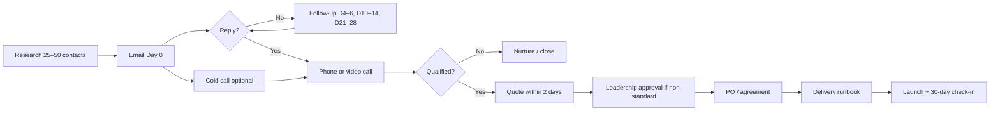

# Go-to-market review — sales & marketing

Internal review of brand positioning, outreach, content, and rep readiness from **first email through delivery**. Last updated: July 2026.

**Audience:** founder, sales rep, marketing.  
**Rep scope:** B2B schools only ([`positioning.md`](positioning.md)).

---

## Executive summary

| Area | Status | Priority fix |
|------|--------|--------------|
| **Brand positioning** | Strong on `/schools`; vision is clear | Align all outbound copy with **Part 107 live** / other tracks roadmap |
| **Email outreach** | Templates + cadence exist | Fix three-track overclaim in [`email-drafts.md`](../../workflows/sales/email-drafts.md); add Part 107–first variants |
| **Phone outreach** | **Missing** | Use [`phone-scripts.md`](../../workflows/sales/phone-scripts.md) |
| **Discovery → quote** | Qualification + quote template ready | Leadership must approve B2B dollar bands in [`packages.md`](packages.md) |
| **Quote → delivery** | Checklist in outreach; no runbook | Use [`delivery-runbook.md`](../../workflows/sales/delivery-runbook.md) |
| **Supporting articles** | Strong B2C (careers, Remote ID); **no school/CTE articles** | Execute [`outreach-content-calendar.md`](../../workflows/marketing/outreach-content-calendar.md) |
| **Collateral gaps** | PDF one-pager, pacing guide, case studies | Rank by objection frequency in weekly review |

---

## Brand positioning

### What we are (approved)

**One-liner:** Part 107–aligned drone education for CTE classrooms and serious self-paced pilots — structured paths, teacher visibility, and practice exams in the browser.

**Pillars for schools:**

1. Outcome clarity — units → sections → exams; progress at course and unit level  
2. Built for real delivery — browser, async/hybrid, org accounts, manager dashboard  
3. Teacher visibility — cohort progress, exam scores, per-student activity  
4. Honest prep depth — 600+ practice items; no fake pass rates  
5. Funding language — link `/schools/funding`; never guarantee eligibility  

**Pillars for individuals (marketing, not rep-led):**

1. Credible Part 107 prep — structured course, Unit 1 free, $29 unlock  
2. Self-paced — no flight-school pricing  
3. From the drone community — safety and field craft, not checkbox cert  

### Visual identity

All decks, PDFs, and email headers must use the official kit ([`docs/marketing/brand-assets.md`](../marketing/brand-assets.md)):

- [`assets/visuals/Presentation/VisualIdentityDroneEdge.pdf`](../../assets/visuals/Presentation/VisualIdentityDroneEdge.pdf)  
- Logos: [`assets/visuals/Logo/`](../../assets/visuals/Logo/)  
- Site tokens (`--brand-primary`) for web; PDF kit for print/slides  

**Tone:** Professional, workforce-aware, anti-hype. Speak like a pilot/instructor, not a SaaS press release. Avoid "revolutionary," guaranteed outcomes, and grant eligibility promises.

### Positioning tension to resolve

| Surface | Says | Truth today |
|---------|------|-------------|
| `/schools/curriculum` | Three tracks (Safety, Creative, STEM) | **Part 107 (Safety) live**; Video/AI coming soon |
| `email-drafts.md` templates | All three tracks available | Same — **rep must lead Part 107** |
| Competitor decks | Pass rates, "used by N districts" | **Prohibited** until documented |

**Rule for all outbound:** Lead with **FAA Part 107 pathway + teacher dashboard**. Mention Creative/STEM as **roadmap / full pathway vision** only when the buyer asks about media or CS. Never sell Video or AI as shippable SKUs.

---

## Rep workflow: outreach → delivery



| Stage | Owner | Doc | SLA |
|-------|-------|-----|-----|
| Research + list approval | Rep | [`outreach.md`](../../workflows/sales/outreach.md) | 25–50/week |
| First email | Rep | [`email-drafts.md`](../../workflows/sales/email-drafts.md) | Day 0 |
| Follow-ups | Rep | Same | D4–6, D10–14, D21–28 |
| Cold call / voicemail | Rep | [`phone-scripts.md`](../../workflows/sales/phone-scripts.md) | After email or for phone-only leads |
| Discovery call | Rep | [`rep-handoff.md`](rep-handoff.md) § Qualification | 30 min |
| Recap email | Rep | [`outreach.md`](../../workflows/sales/outreach.md) § Post-call recap | **≤ 1 business day** |
| Quote | Rep → leadership | [`quote-template.md`](quote-template.md) | **≤ 2 business days** if qualified |
| Org setup + launch | Product / admin | [`delivery-runbook.md`](../../workflows/sales/delivery-runbook.md) | Per agreed launch date |
| Mid-year check-in | Rep | Delivery runbook § Success | Classroom/Program tiers |

---

## Email outreach — what works, what to fix

### Strengths

- Role-specific templates (CTE, STEM, principal, grants)  
- Short length targets (60–100 words first touch)  
- One link, one ask  
- Funding follow-up correctly disclaims eligibility  
- Cadence and tracker schema in [`outreach.md`](../../workflows/sales/outreach.md)  

### Fixes (apply now)

1. **First-touch default:** Use Part 107–first template in `email-drafts.md` § Recommended first-touch — not the legacy "three tracks available" opener.  
2. **Follow-up 1 in `outreach.md`:** Do not list Video/AI as live; say Part 107 is live, other tracks on roadmap.  
3. **Subject lines:** Prefer "FAA Part 107 pathway for [District]" over "Three-track drone course" until Creative/STEM ship.  
4. **Attachments:** Still no PDF on first touch — but prepare a **one-page school PDF** for post-reply sends (top collateral gap).  
5. **UTM / source tracking:** Add `?utm_source=outreach&utm_medium=email&utm_campaign=[campaign]` to consultation links when CRM supports it.

### Recommended first-touch (Part 107 lead)

```text
Hi [Name],

I saw [personalization] at [School/District] and wanted to ask if you are building or exploring a drone / FAA Part 107 pathway for students.

Drone Edge is a browser-based Part 107 prep platform with structured units, 600+ practice questions, and a manager dashboard so teachers see cohort progress — async, hybrid, or teacher-led.

Worth a 15-minute call this month?

https://thedroneedge.com/schools

Best,
[Name]
Drone Edge
```

---

## Phone outreach

Email-first is the default (school admins filter unknown numbers). Phone works best:

- **Day 4–6** after email with no reply (reference the email)  
- **Warm reply** to book time faster than async  
- **Directory-listed CTE lines** where email bounces  

Full scripts: [`workflows/sales/phone-scripts.md`](../../workflows/sales/phone-scripts.md).

**Voicemail rule:** Under 25 seconds; name, one reason, email sent, callback or consultation URL.

**Do not:** Cold-call without a prior email except verified high-fit lists; leave multiple voicemails same week; discuss pricing on a cold call.

---

## Discovery call → close

Use [`rep-handoff.md`](rep-handoff.md):

- **15-minute demo path:** `/schools` → `/schools/curriculum` → `/schools/funding` → live student view → **`/manager` dashboard** (closes most deals)  
- **Qualification:** program type, student count, start semester, buyer, PO/grant path  
- **Objections:** honest prep depth, no pass rates; SSO/LTI roadmap; funding page not eligibility  

**Quote tiers:** Pilot (eval semester) → Classroom (year) → Program/District (multi-section/year). Dollar amounts are **internal placeholders** — rep sends DRAFT until leadership approves ([`packages.md`](packages.md)).

---

## Delivery (post-close)

Rep hands off to product/admin using [`delivery-runbook.md`](../../workflows/sales/delivery-runbook.md):

1. Org created, course assigned, seat cap set  
2. Manager accounts + onboarding call scheduled  
3. Invite codes / student onboarding instructions sent  
4. Launch date confirmed; rep sends welcome email to buyer  
5. 30-day (Pilot) or mid-year (Classroom) check-in on calendar  

Rep stays on the account for expansion and renewal; does not provision orgs unless trained.

---

## Content for outreach credibility

Prospects Google you after the first email. Today they find industry news and B2C career content — **not** school-specific proof.

### Live content reps can link today

| Article / page | Audience | Use in outreach |
|----------------|----------|-----------------|
| [`/schools`](https://thedroneedge.com/schools) | B2B | Primary CTA |
| [`/schools/curriculum`](https://thedroneedge.com/schools/curriculum) | B2B | Depth after interest |
| [`/schools/funding`](https://thedroneedge.com/schools/funding) | B2B grants | Follow-up 3 / funding angle |
| [Drone careers article](https://thedroneedge.com/articles/story-11-drone-careers) | B2C / career pathway | "Why Part 107 matters for students" in recap |
| [Remote ID article](https://thedroneedge.com/articles/story-05-faa-remote-id) | Safety / compliance | Safety-track buyers |
| Course preview | B2C demo | "See student experience" — `/courses/35/preview` |

### Content gaps (build for rep link library)

Priority order in [`outreach-content-calendar.md`](../../workflows/marketing/outreach-content-calendar.md):

1. **"Part 107 in the high school CTE classroom"** — pacing, hybrid delivery, teacher role  
2. **"How schools fund drone programs (without overpromising)"** — companion to funding page, linkable in email  
3. **"Teacher dashboard: what program leads actually see"** — screenshots, manager workflow  
4. **"Drone program vs kit-only STEM"** — answers "we already bought drones" objection  
5. **Case study / pilot story** — after first school win (placeholder until then)  

B2C articles (Part 107 study guide, $29 vs alternatives) support marketing and give reps a **student-facing proof point** when teachers ask "what will my kids see?"

---

## Marketing angles by buyer segment

| Segment | Lead angle | Proof points | Avoid |
|---------|------------|--------------|-------|
| **CTE / career academy** | Part 107 = industry credential; employability | Curriculum page, manager dashboard, careers article | Guaranteed pass / job placement |
| **STEM coordinator** | Applied flight systems, weather, data — **via Part 107 units today** | Unit structure, question bank | Selling AI track as live |
| **Media / arts teacher** | Aerial storytelling starts with **safe, legal ops** (Part 107) | Safety framing; Creative track roadmap | Promising full media curriculum now |
| **Grants / business office** | CTE/workforce language; PA SMART context | `/schools/funding` | Eligibility guarantees |
| **Superintendent** | Career readiness + scalable delivery across sites | Program tier, org model | Deep product demo on first touch |
| **Community college workforce** | Adult learners, async, exam prep density | Pilot tier, preview page | K-12 pacing assumptions |

---

## Collateral priority (rank by deal friction)

| Asset | Effort | Impact | Owner |
|-------|--------|--------|-------|
| One-page school PDF | Low | High — post-reply sends | Marketing |
| Approved B2B price bands | Low | High — rep autonomy | Leadership |
| Pacing guide / semester map | Medium | High — curriculum approval | Product + marketing |
| Manager dashboard screenshots | Low | High — demo without login | Marketing |
| Case study (1 pilot school) | Medium | Very high | Rep + marketing |
| Calendly on `/consultation` | Low | Medium | Product |
| VPAT / DPA packet | High | Medium (late stage) | Legal / product |

---

## Metrics (first 90 days)

Track weekly in CRM/spreadsheet ([`outreach.md`](../../workflows/sales/outreach.md) § Funnel stages):

| Metric | Target (starting) |
|--------|-------------------|
| Contacts researched | 100+ in first segment |
| First-touch emails sent | 25–50/week |
| Reply rate | Baseline TBD — log by segment |
| Meetings booked | 2–5/month manual phase |
| Qualified opps | 1–2/month |
| Quotes sent | Within 2 days of qualification |
| Wins | First pilot = success signal |

Also log: **objections**, **collateral requests**, **which article links get clicks** (once UTM added).

---

## Related docs

| Doc | Purpose |
|-----|---------|
| [`positioning.md`](positioning.md) | Claims and ICP |
| [`rep-handoff.md`](rep-handoff.md) | Day-one rep guide |
| [`packages.md`](packages.md) | Tiers and pricing structure |
| [`workflows/sales/outreach.md`](../../workflows/sales/outreach.md) | Full outreach playbook |
| [`workflows/sales/email-drafts.md`](../../workflows/sales/email-drafts.md) | Email templates |
| [`workflows/sales/phone-scripts.md`](../../workflows/sales/phone-scripts.md) | Phone and voicemail |
| [`workflows/sales/delivery-runbook.md`](../../workflows/sales/delivery-runbook.md) | Post-close delivery |
| [`workflows/marketing/outreach-content-calendar.md`](../../workflows/marketing/outreach-content-calendar.md) | Articles for reps to share |

*Update when Creative/STEM tracks ship, B2B pricing is approved, or first school case study publishes.*
