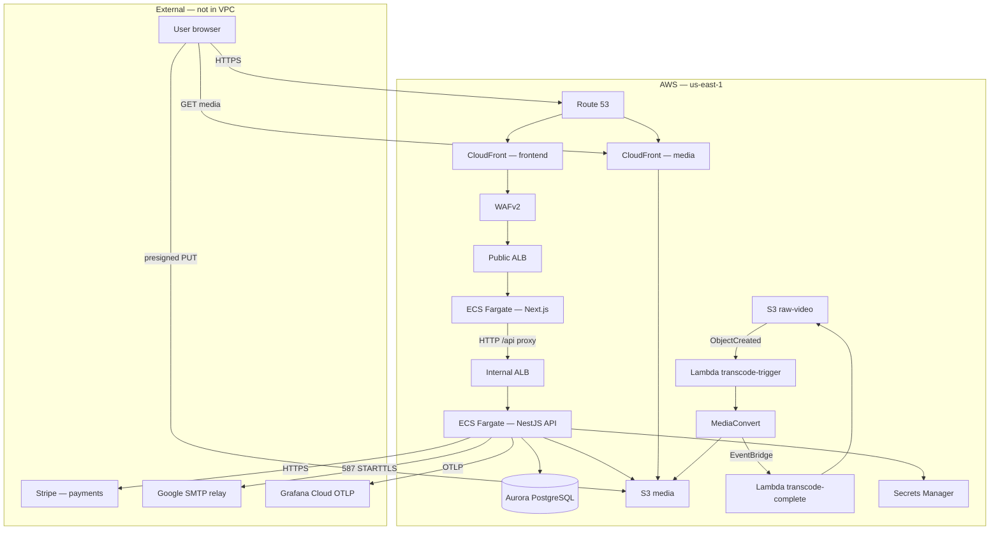
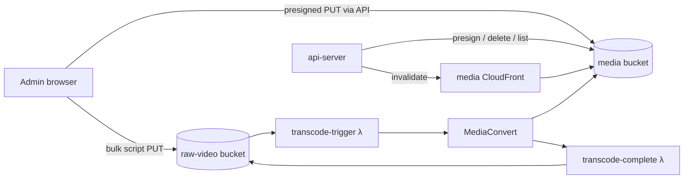

# Infrastructure architecture

Deployed environment: **`droneedge-dev`** (`terraform/env/dev.tfvars`) in **AWS us-east-1**. This stack serves production traffic on `thedroneedge.com` today. See [`environment-split-plan.md`](environment-split-plan.md) for dev/prod naming notes.

**Scope:** Terraform-managed AWS resources, application runtime dependencies, and external services (Stripe, email, observability). Users reach the product through a **browser**; there is no native mobile app in this repo.

---

## System context



---

## Request paths

### Page and API (same origin from browser)

| Step | Component | Notes |
|------|-----------|--------|
| 1 | Browser | `https://thedroneedge.com`, `www`, `app`, `app.dev` |
| 2 | Route 53 | A/ALIAS → frontend CloudFront |
| 3 | WAFv2 | Managed rules + 1000 req/IP rate limit |
| 4 | CloudFront (frontend) | Origin = public ALB (HTTP). Caches `/_next/static/*`, `/images/*`; forwards cookies/Authorization on default behavior |
| 5 | Public ALB | Host-based rules → frontend target group :8080 |
| 6 | Next.js (`drone-frontend`) | SSR/RSC + client bundles. `/api/*` proxied server-side to internal ALB |
| 7 | Internal ALB | HTTP :80 → API target group :3000 |
| 8 | NestJS (`api-server`) | JWT cookies, TypeORM → Aurora, Stripe, S3, email |

The API is **not** exposed on a public `api.thedroneedge.com` record. Browsers only talk to the frontend origin; the BFF proxy is `drone/src/app/api/[...path]/route.ts`.

### Media upload and playback

| Flow | Path |
|------|------|
| **Upload (admin)** | Browser → `POST /api/media/...` → API presigned URL → browser **PUT** direct to S3 `droneedge-dev-media` (CORS allows site origins) |
| **Public images** | Browser → `https://media.thedroneedge.com/{key}` → media CloudFront → S3 |
| **Paid course video** | Browser → signed URL from API (`SignedUrlService`) → media CloudFront path `courses/videos/*` (trusted key group) |
| **Bulk transcode** | Operator → S3 `droneedge-dev-raw-video` → Lambda trigger → MediaConvert → HLS under `courses/videos/` in media bucket |

### Stripe (external)

| Flow | Path |
|------|------|
| **Checkout** | Browser loads Stripe.js (`@stripe/stripe-js`) with publishable key baked at frontend build. PaymentIntent created via `/api/purchases/...` → API → **Stripe API** |
| **Webhooks** | **Stripe** → must reach API webhook endpoint (via same CloudFront/ALB/frontend proxy path as other POSTs) |

---

## AWS resource inventory

All names use prefix **`droneedge-dev-`** unless noted. Count ≈ **120** managed objects in Terraform state.

### Compute — ECS Fargate

| Resource | Name / ID pattern | Purpose |
|----------|-------------------|---------|
| ECS cluster | `droneedge-dev-cluster` | API service |
| ECS cluster | `droneedge-dev-frontend-cluster` | Frontend service |
| ECS service | `droneedge-dev-api-server-service` | NestJS API, desired 1, scale 1–5 CPU |
| ECS service | `droneedge-dev-drone-frontend-service` | Next.js, desired 1, scale 1–3 CPU |
| Task definition | `droneedge-dev-api-server-task` | 512 CPU / 1024 MiB, 1 container |
| Task definition | `droneedge-dev-drone-frontend-task` | 512 CPU / 1024 MiB, 1 container |
| ECR repo | `droneedge-dev-api-server` | API image |
| ECR repo | `droneedge-dev-drone-frontend` | Frontend image |

### Load balancing

| Resource | Name | Visibility |
|----------|------|------------|
| ALB | `droneedge-dev-alb` | Internet-facing, public subnets |
| ALB | `droneedge-dev-backend-alb` | Internal, private subnets |
| Target group | `droneedge-dev-frontend-tg` | :8080 → frontend tasks |
| Target group | `droneedge-dev-api-internal-tg` | :3000 → API tasks, health `/health` |

### CDN & edge

| Resource | Domain aliases | Origin |
|----------|--------------|--------|
| CloudFront | `thedroneedge.com`, `www`, `app`, `app.dev` | Public ALB |
| CloudFront | `media.thedroneedge.com` | S3 media bucket (OAC) |
| WAFv2 ACL | Attached to **frontend** distribution only | — |
| ACM cert | SANs: apex, www, app, app.dev, api, media | DNS validation in Route 53 |
| CloudFront public key + key group | Video signing | Backend signs with private key in Secrets Manager |

### Data — Aurora PostgreSQL

| Resource | Value |
|----------|--------|
| Cluster | `droneedge-dev-aurora-cluster` |
| Engine | Aurora PostgreSQL, Serverless v2 |
| Database | `blog` |
| Capacity | 0.5–2 ACU |
| Instances | 1 × `db.serverless` |
| Network | Private subnets only; SG ingress from API tasks :5432 |
| Credentials | Secrets Manager `droneedge-dev-db-credentials` |

### Storage — S3

| Bucket | Purpose |
|--------|---------|
| `droneedge-dev-media` | Article/course/profile media; HLS output; CloudFront origin |
| `droneedge-dev-raw-video` | Staging uploads for transcode; **7-day lifecycle expiry** |
| `droneedge-dev-logs-{account_id}` | CloudWatch Logs export destination (versioned); policy for Logs service |

### Serverless — video pipeline

| Resource | Trigger | Role |
|----------|---------|------|
| `droneedge-dev-transcode-trigger` | S3 `ObjectCreated` on raw-video (`.mp4`, `.mov`, `.mkv`, `.webm`) | Start MediaConvert job |
| `droneedge-dev-transcode-complete` | EventBridge MediaConvert job COMPLETE/ERROR | Tag raw object status |
| MediaConvert service role | `droneedge-dev-mediaconvert-role` | Read raw bucket, write `courses/videos/*` |
| EventBridge rule | `droneedge-dev-mediaconvert-complete` | Job state changes |

### Networking — VPC

| Resource | CIDR / detail |
|----------|----------------|
| VPC | `10.0.0.0/16` |
| Public subnets | `10.0.10.0/24`, `10.0.11.0/24` (2 AZs) |
| Private subnets | `10.0.20.0/24`, `10.0.21.0/24` |
| Internet gateway | Public ingress/egress |
| NAT gateway | Single NAT + EIP (private subnet egress; also in SPF for SMTP) |
| VPC endpoints (gateway) | S3 → private route table |
| VPC endpoints (interface) | Secrets Manager, CloudWatch Logs, ECR API, ECR DKR |

### DNS & email (Route 53)

| Record | Target |
|--------|--------|
| `thedroneedge.com`, `www`, `app`, `app.dev` | Frontend CloudFront |
| `media.thedroneedge.com` | Media CloudFront |
| MX | Google Workspace |
| TXT SPF | Google + NAT EIP |
| TXT DMARC | Quarantine + RUA to admin email |
| ACM validation | CNAMEs per SAN |

DKIM: manual TXT in console (documented in `terraform/email_dns.tf`).

### Secrets Manager

| Secret | Injected into |
|--------|----------------|
| `droneedge-dev-db-credentials` | API `DB_PASSWORD` (execution role) |
| `droneedge-dev-jwt-secret` | API |
| `droneedge-dev-stripe-secret-key` | API |
| `droneedge-dev-stripe-webhook-secret` | API |
| `droneedge-dev-admin-seed-password` | API |
| `droneedge-dev-grafana-otel-headers` | API OTLP auth |
| `droneedge-dev-cloudfront-signing-private-key` | API video URL signing |

Values for Stripe/JWT/admin are **not** in Terraform; seeded manually or via pipeline reconcile scripts.

### IAM (shared ECS roles)

| Role | Used by | Attachments |
|------|---------|-------------|
| `droneedge-dev-ecs-task-execution-role` | Both tasks | `AmazonECSTaskExecutionRolePolicy`, custom Secrets Manager read |
| `droneedge-dev-ecs-task-role` | Both tasks (API uses it; frontend largely unused) | CloudWatch Logs write (API log group), S3 media + CF invalidation |

Separate roles: MediaConvert, transcode Lambdas, VPC flow logs.

### Observability & ops

| Resource | Purpose |
|----------|---------|
| Log group `/ecs/droneedge-dev/api-server` | API container stdout + Winston CloudWatch transport |
| Log group `/ecs/droneedge-dev/frontend` | Next.js stdout |
| Log group `/vpc/droneedge-dev/flow-logs` | VPC flow logs (optional, default on) |
| Budget | `droneedge-dev-monthly-budget` — $150/mo alerts |

### App autoscaling

| Service | Metric | Target | Min / max tasks |
|---------|--------|--------|-----------------|
| API | ECS CPU avg | 75% | 1 / 5 |
| Frontend | ECS CPU avg | 75% | 1 / 3 |

---

## Security groups (traffic matrix)

| From | To | Port | Purpose |
|------|-----|------|---------|
| Internet | `lb_sg` | 80, 443 | Public ALB |
| `lb_sg` | `frontend_tasks_sg` | 8080 | ALB → Next.js |
| `frontend_tasks_sg` | `internal_lb_sg` | 80 | API proxy |
| `internal_lb_sg` | `ecs_tasks_sg` | 3000 | Internal ALB → API |
| `ecs_tasks_sg` | `aurora_sg` | 5432 | API → Postgres |
| Private subnets | `vpc_endpoints` | 443 | AWS API calls |
| `ecs_tasks_sg` | Internet via NAT | 443, 587, 53 | Stripe, Grafana, SMTP, DNS |

API tasks have **no** ingress from the public internet or public ALB—only from the internal ALB.

---

## Component views

ECS Fargate tasks run **one container each**—there are **no sidecar containers**. Logging uses the **`awslogs` log driver** (not a separate container). OpenTelemetry runs **in-process** in the API via `node --require ./dist/src/telemetry.js`.

---

### 1. Browser (client)

| Aspect | Detail |
|--------|--------|
| **Runtime** | User device; Chrome/Safari/Firefox/etc. |
| **Dependencies** | HTML/JS/CSS from frontend CloudFront; media from media CloudFront |
| **Auth** | HttpOnly cookies set by API, forwarded through Next.js proxy |
| **Payments** | Stripe.js loaded in browser; publishable key from `NEXT_PUBLIC_STRIPE_PUBLISHABLE_KEY` (build-time) |
| **Direct AWS** | Presigned S3 PUT to media bucket (uploads only); no AWS credentials in browser |
| **Video** | HLS via `hls.js` for self-hosted; YouTube/Vimeo embeds where configured |

**Permissions:** None on AWS. Trust boundary = same-origin cookies + CORS on media bucket for listed site origins.

---

### 2. Frontend — `drone-frontend` (Next.js 15)

| Aspect | Detail |
|--------|--------|
| **Image** | `956463123464.dkr.ecr.us-east-1.amazonaws.com/droneedge-dev-drone-frontend:{git-sha}` |
| **Cluster / service** | `droneedge-dev-frontend-cluster` / `droneedge-dev-drone-frontend-service` |
| **Port** | 8080 |
| **Process** | `next start -p 8080` (Node 20 Alpine) |
| **Sidecars** | None |
| **Log driver** | `awslogs` → `/ecs/droneedge-dev/frontend` |

#### Environment (runtime)

| Variable | Source | Purpose |
|----------|--------|---------|
| `API_INTERNAL_BASE_URL` | Terraform → internal ALB DNS | Server-side API proxy & RSC fetches |
| `NEXT_PUBLIC_STRIPE_PUBLISHABLE_KEY` | tfvars | Stripe.js (inlined at **build** in Docker) |
| `NEXT_PUBLIC_CLOUDFRONT_DOMAIN` | Terraform | Media URL construction |
| `NEXT_PUBLIC_DEBUG_LOGGING` | tfvars | Client debug logs |
| `NEXT_PUBLIC_SITE_URL` | Docker build-arg | Sitemap, metadata, JSON-LD |

#### IAM

| Role | Effective use |
|------|----------------|
| **Execution role** | ECR pull, CloudWatch Logs stream create |
| **Task role** | S3/CloudWatch policies attached but **not used by Next.js** at runtime |

#### Network egress

| Destination | Port | Why |
|-------------|------|-----|
| Internal ALB (VPC) | 80 | All `/api/*` proxy traffic |
| HTTPS (via NAT/endpoints) | 443 | Occasional external fetches if any RSC paths call out |

#### App dependencies (npm)

`next`, `react`, `@stripe/stripe-js`, `@stripe/react-stripe-js`, `hls.js`, `zod`, Tailwind—no AWS SDK in frontend.

#### Deploy note

Task definition uses `lifecycle.ignore_changes` on `container_definitions`; image updates go through **pipeline ECS task-def registration** (see [`workflows/tech/deploy.md`](../../workflows/tech/deploy.md)).

---

### 3. API — `api-server` (NestJS 11)

| Aspect | Detail |
|--------|--------|
| **Image** | `956463123464.dkr.ecr.us-east-1.amazonaws.com/droneedge-dev-api-server:{git-sha}` |
| **Cluster / service** | `droneedge-dev-cluster` / `droneedge-dev-api-server-service` |
| **Port** | 3000 |
| **Process** | `node --require ./dist/src/telemetry.js dist/src/main.js` |
| **Sidecars** | None (OTEL SDK is in-process) |
| **Log driver** | `awslogs` → `/ecs/droneedge-dev/api-server` + Winston → same group in production |

#### Secrets (execution role → Secrets Manager)

| Env var | Secret |
|---------|--------|
| `DB_PASSWORD` | `db-credentials` (json key `password`) |
| `STRIPE_SECRET_KEY` | `stripe-secret-key` |
| `STRIPE_WEBHOOK_SECRET` | `stripe-webhook-secret` |
| `JWT_SECRET` | `jwt-secret` |
| `ADMIN_SEED_PASSWORD` | `admin-seed-password` |
| `OTEL_EXPORTER_OTLP_HEADERS` | `grafana-otel-headers` |
| `CLOUDFRONT_SIGNING_PRIVATE_KEY` | `cloudfront-signing-private-key` |

#### Environment (plain)

| Variable | Purpose |
|----------|---------|
| `DB_HOST`, `DB_USER`, `DB_NAME`, `DB_PORT`, `DB_SSL` | Aurora connection |
| `FRONTEND_URL` | CORS origin (`https://thedroneedge.com`) |
| `S3_MEDIA_BUCKET` | Presigned uploads, orphan cleanup |
| `CLOUDFRONT_MEDIA_DOMAIN` | Public URL prefix |
| `CLOUDFRONT_DISTRIBUTION_ID` | Invalidation on delete |
| `CLOUDFRONT_KEY_PAIR_ID` | Signed video URLs |
| `EMAIL_*`, `ADMIN_EMAIL` | Nodemailer → Google SMTP relay |
| `OTEL_*` | Grafana Cloud traces/metrics |
| `AWS_REGION` | SDK default region |

#### IAM task role permissions

| Policy | Actions | Resources |
|--------|---------|-----------|
| `cloudwatch-logs-policy` | `CreateLogStream`, `PutLogEvents`, `DescribeLogStreams` | API log group |
| `s3-media-policy` | `PutObject`, `DeleteObject`, `ListBucket` | Media bucket |
| `s3-media-policy` | `cloudfront:CreateInvalidation` | Media distribution ARN |

SDK calls use **task role credentials** via ECS metadata (no static keys in env).

#### Network egress

| Destination | Port | Service |
|-------------|------|---------|
| Aurora (private) | 5432 | PostgreSQL |
| S3 (VPC endpoint) | 443 | Presigned URL generation server-side; List/Delete |
| Secrets Manager (endpoint) | 443 | Startup secret fetch (execution role) |
| **Stripe API** | 443 | External — PaymentIntents, webhooks verify |
| **Grafana OTLP** | 443 | External — `otlp-gateway-prod-us-east-2.grafana.net` |
| **smtp-relay.gmail.com** | 587 | External — transactional email |
| CloudFront API | 443 | Invalidations (via NAT) |

#### App dependencies (npm → runtime)

| Package | Use |
|---------|-----|
| `@nestjs/*`, `typeorm`, `pg` | API + Aurora |
| `stripe` | Payments (**external**) |
| `@aws-sdk/client-s3`, `s3-request-presigner` | Media uploads |
| `@aws-sdk/client-cloudfront`, `cloudfront-signer` | Invalidation + signed URLs |
| `nodemailer` | SMTP (**external** Google) |
| `winston`, `winston-cloudwatch` | Logging |
| `@opentelemetry/*`, `nestjs-otel` | Telemetry (**external** Grafana) |
| `bcrypt`, `passport-jwt`, `@nestjs/jwt` | Auth |

#### Data stores

| Store | Access |
|-------|--------|
| Aurora `blog` | All entities (users, courses, articles, purchases, orgs, progress, …) |
| S3 media | Object keys referenced in DB JSON columns |

---

### 4. Aurora PostgreSQL

| Aspect | Detail |
|--------|--------|
| **Identifier** | `droneedge-dev-aurora-cluster` |
| **Access** | API tasks only (SG-bound) |
| **Migrations** | TypeORM migrations on API boot (`typeorm:run`) |
| **Backups** | 7-day retention; `skip_final_snapshot = true` in Terraform (risk note for prod scale-up) |

No application connects except `api-server`. Frontend never touches the database.

---

### 5. Media stack (S3 + CloudFront + transcode)



| Component | Permissions summary |
|-----------|---------------------|
| **api-server** | S3 read/write/list on media; CF invalidation; signs URLs for `courses/videos/*` |
| **transcode-trigger λ** | Read raw objects; `mediaconvert:CreateJob`; `iam:PassRole` to MediaConvert role |
| **MediaConvert role** | Get raw video; Put HLS to `media/courses/videos/*` |
| **transcode-complete λ** | Tagging on raw bucket objects |
| **Public browser** | GET via CloudFront; PUT via presigned URLs (CORS) |

---

### 6. Lambda functions (transcode)

#### `droneedge-dev-transcode-trigger`

| Field | Value |
|-------|--------|
| Runtime | nodejs20.x |
| Trigger | S3 notification on raw-video bucket |
| Env | `MEDIA_BUCKET`, `MEDIACONVERT_ROLE`, `OUTPUT_PREFIX`, `AWS_REGION_CUSTOM` |
| Timeout | 30s |

#### `droneedge-dev-transcode-complete`

| Field | Value |
|-------|--------|
| Runtime | nodejs20.x |
| Trigger | EventBridge rule on MediaConvert job state |
| Env | `RAW_BUCKET` |
| Timeout | 15s |

Neither Lambda is in the VPC (default AWS-managed networking).

---

### 7. Shared platform services

| Service | Used by | Notes |
|---------|---------|-------|
| **ECR** | ECS execution roles | Image pull via vpc endpoints + auth |
| **Secrets Manager** | API execution role | Injected at task start |
| **Route 53** | Public DNS | Hosted zone for `thedroneedge.com` |
| **ACM** | Both CloudFront distributions, public ALB HTTPS | us-east-1 |
| **WAF** | Frontend CloudFront only | Not on media distribution |
| **AWS Budgets** | Account | Email alerts to admin |

---

## External services

| Service | Role | Called from | Credentials |
|---------|------|-------------|-------------|
| **Stripe** | Payments, webhooks | API (+ Stripe.js in browser) | Secret key + webhook secret in Secrets Manager; publishable key in frontend build |
| **Google Workspace SMTP** | Outbound email | API (`nodemailer`) | No auth in env—IP allowlist (NAT EIP in SPF) |
| **Grafana Cloud** | Metrics & traces | API (OTLP HTTP) | Basic auth header in Secrets Manager |

---

## Application ↔ infrastructure map

| App module | AWS / external |
|------------|----------------|
| Auth / users / orgs | Aurora |
| Courses / articles / progress | Aurora + media S3/CF |
| `MediaService` | S3 presign, CF invalidation |
| `SignedUrlService` | CloudFront URL signing (private key) |
| `PurchaseService` | **Stripe** + Aurora |
| Email modules | **Google SMTP** |
| `telemetry.ts` | **Grafana OTLP** |
| Next.js `/api/*` proxy | Internal ALB → API |
| Admin media upload UI | Browser → S3 presigned PUT |

---

## Deploy pipeline (summary)

```
git push → pipeline.sh
  → docker build/push (ECR :git-sha)
  → terraform apply (infra vars; image URIs)
  → register new ECS task def + update service
  → CloudFront invalidation (frontend)
```

Images: Node 20. Terraform: local state file (`terraform/terraform.tfstate`). See [`workflows/tech/deploy.md`](../../workflows/tech/deploy.md).

---

## Related docs

| Doc | Topic |
|-----|--------|
| [`backend-data.md`](backend-data.md) | REST API & entities |
| [`frontend-data.md`](frontend-data.md) | Routes & client API |
| [`environment-split-plan.md`](environment-split-plan.md) | Dev/prod split |
| [`../sales/features.md`](../sales/features.md) | Product capabilities |

---

*Generated from Terraform in `terraform/` and application code in `backend/`, `drone/`. Re-run `terraform state list` after infra changes to verify inventory.*
