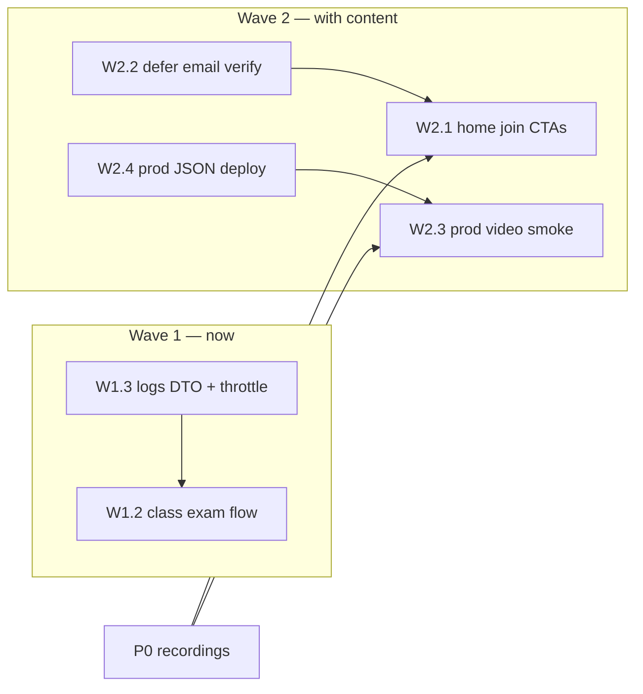

# Wave 1 + Wave 2 implementation plan

Detailed plan for the pre-launch engineering waves defined in [`../TODO.md`](../TODO.md) (P2 → "Tech plan — sequenced"). Wave 1 = correctness fixes unblocked now; Wave 2 = launch-blocking product surface that lands with course content.

**Status legend:** ⬜ open · 🔶 partial · ✅ done

---

## Wave 1 — correctness (start now)

### W1.1 — Exam scope reuse bug (H3) — ✅ already fixed

**Finding (Jul 2026):** the fix is in `exam-generator.service.ts` — the reuse query
enforces scope-ref set equality (`e.scope_refs <@ :refs AND e.scope_refs @> :refs`
on sorted refs), so a pending Unit 5 exam is never served for a Unit 6 request.
Covered by `exam-generator.service.spec.ts` → "constrains randomized exam reuse to
identical scope_refs (H3)" (suite passes 6/6).

**Remaining:** none. Marked Done in `TODO.md`.

---

### W1.2 — Class exam student flow (G2) — ✅ done (Jul 2026)

Shipped: `GET /exams/class/assigned`, `assertExamAccess` (org assignment bypasses
purchase), `AssignedClassExamsSection` on exam hub, `/courses/[courseId]/exams/assigned/[examId]`,
`ExamPlayer` `examId` mode. Remaining: profile-level assigned-exams card (optional).

---

### W1.3 — Tighten `POST /logs`

**Today:** `LoggingController.logMessage` takes an untyped body. The global
`ThrottlerGuard` (registered via `APP_GUARD` in `AuthModule`, 30 req/min) already
covers it, but: no DTO → global `ValidationPipe({ whitelist: true })` strips
nothing; unbounded `message`/`context` can flood Winston/CloudWatch; `level` is
unvalidated.

| Task | Detail |
|------|--------|
| `FrontendLogDto` | `level: 'info' \| 'warn' \| 'error'` (`@IsIn`), `message: string` (`@MaxLength(2000)`), `context?: Record<string, unknown>` (`@IsObject`, optional). Reject others via whitelist + `forbidNonWhitelisted` not required (strip is fine). |
| Stricter throttle | `@Throttle({ default: { limit: 10, ttl: 60_000 } })` on the handler — logs shouldn't need 30/min per client. |
| Context size cap | Serialize context; if `JSON.stringify(ctx).length > 8_000`, truncate with a `"…truncated"` marker before logging. |
| Optional (defer) | Require auth in production (`OptionalJwtAuthGuard` + drop anonymous error-level only); revisit if abuse observed. |

**Acceptance:** invalid `level` → 400; >2000-char message → 400; 11th request in a minute → 429; e2e logging test still passes.

**Estimate:** ~2 hours.

---

## Wave 2 — launch-blocking product surface

### W2.1 — Home page join CTAs

Blocked-on: Part 107 recordings shipping (funnel must be real). Implementation is
ready to go when content lands.

| Task | File | Detail |
|------|------|--------|
| Hero primary CTA | `drone/src/app/page.tsx` | Replace primary "Courses" button with **"Try Unit 1 free"** → `registerHref(coursePath(FEATURED_COURSE_ID))`. Keep "Courses" as secondary (border style). |
| Hero secondary CTA | `page.tsx` | Add **"Part 107 course — $29"** → `/courses/1/preview` (price/preview surface; preview page handles auth-aware CTAs). Drop "Articles" from hero buttons (nav covers it). |
| `HomeAuthCta` | `home-auth-cta.tsx` | Logged-out: **"Create account"** (visible button style) + keep "Sign in" as text link; logged-in: "Profile" unchanged. |
| Header join CTA | `header.tsx` | Logged-out: primary **"Get started"** → `/register`, demote "Login" to text link (unify label with "Sign in"). Mobile menu: same pair. |
| FAA track card | `page.tsx` | Point the Part 107 track card at `/courses/1/preview` instead of `/courses`. |
| Tracks honesty | `page.tsx` | Add "Coming soon" badge on Video/AI cards; swap "View course" → "Preview track". (Remove if both courses ship first.) |
| Closing CTA band | `page.tsx` | Section before footer: "Start free — Unit 1, no credit card" + register CTA (reuse `login-conversion-panel` copy). |
| Landmark fix | `page.tsx` | Hero `<main>` is nested inside layout's `<main id="main-content">` — change hero wrapper to `
`/`<section>`; promote visible headline `
` → `<h1>` (drop `sr-only` h1). |
| Config | — | `FEATURED_COURSE_ID = 1` constant in `auth-redirect.ts` (already defaulted in `login-conversion-panel.tsx`; unify). |

**Acceptance:** logged-out visitor sees a register path above the fold and at page end; header offers Get started on every page; FAA card lands on the preview funnel; Lighthouse a11y pass on landmarks.

**Estimate:** ~½ day + copy review.

---

### W2.2 — Defer email verification for Unit 1 preview

**Today:** `AuthService.validateUser` rejects login when `is_email_verified` is
false — an unverified user cannot log in at all, so the freemium funnel costs a
verify round-trip before any content. Purchase requires login, so verification
also gates checkout.

**Design decision (recommended):** allow **login without verification**, gate
**purchase and org-invite consumption** on verified email, and show a persistent
verify banner. Unit 1 free preview needs nothing but a session.

#### Backend

| Task | Detail |
|------|--------|
| Allow unverified login | Remove the `is_email_verified` rejection in `validateUser`. |
| Claim in JWT + profile | Add `email_verified: boolean` to the access-token payload and `GET /auth/profile` (`UserDto`). Token refresh picks up the new value after verify (or re-login; acceptable). |
| Gate purchases | In `PurchaseController.createPaymentIntent` (and `confirmPayment`), load user and throw 403 `EMAIL_NOT_VERIFIED` when unverified. Keeps Stripe metadata trustworthy. |
| Gate invite consumption | `validateAndConsumeInviteCode` at register already runs pre-verify — leave (invite implies known email); no change. |
| Resend endpoint | `POST /auth/resend-verification` (JWT): regenerate token + expiry, `sendEmailVerification`. Throttle `3/hour`. Today there is **no** resend path — dead end if the email is lost. |
| Tests | e2e: unverified login succeeds; unverified `create-payment-intent` → 403; verify → purchase succeeds; resend flow. |

#### Frontend

| Task | Detail |
|------|--------|
| Verify banner | Global banner (under header) when `user && !user.email_verified`: "Verify your email to purchase — resend link". Dismissible per session. |
| Purchase flow copy | `purchase-flow.tsx`: when logged in but unverified, replace card form with "Verify your email to continue" + resend button (reads the 403 code as fallback). |
| Register flow | After register, log the user in client-side? **No** — registration response has no tokens today. Simpler: keep "check your email" screen but add "Skip for now — start Unit 1" → `/login` (they can now log in unverified). Optional later: auto-login on register (backend change, defer). |
| `UserDto` type | Add `email_verified` to `drone` user type; api-client untouched otherwise. |

**Acceptance:** new user can register → log in → read Unit 1 without touching email; purchase blocked with clear verify prompt + working resend; verified user flow unchanged.

**Estimate:** ~1 day backend + ½ day frontend.

**Risk note:** relaxing login broadens spam-account surface — register throttle
already exists (30/min global; consider `5/hour` on `POST /auth/register`).

---

### W2.3 — Verify prod video signing end-to-end (ops checklist)

Depends on the first real recording (P0). No code expected — fail-closed logic and
signed cookies shipped Jul 2026.

1. Confirm Secrets Manager (prod) has `CLOUDFRONT_KEY_PAIR_ID` + private key; backend env wires both (`SignedUrlService` throws in prod if missing — a healthy boot is itself a check).
2. Upload one HLS rendition set to `media.thedroneedge.com` (courses bucket path), set `video_url` on a Unit 1 node, redeploy course JSON.
3. Smoke test as a paying user: master playlist loads (signed cookies set by `GET /courses/:courseId/units/:unitId/media`), variant playlists + `.ts`/`.m4s` segments return 200 (not 403), seek works.
4. Negative test: logged-out / non-purchaser direct segment URL → 403.
5. Confirm CORS headers from the `droneedge-dev-video-cors` policy equivalent in prod distribution.

**Estimate:** ~2 hours once a video exists.

---

### W2.4 — Deploy latest course + question JSON to prod — ✅ done (Jul 8 2026)

Shipped: restructured Part 107 course payload + unit-level question bank (`faa_107_questions_unit_level.bulk.json`) live in prod alongside current app code. See [`TODO_COMPLETED.md`](../TODO_COMPLETED.md).

**Remaining:** FINAL_EXAM pool carry-over, fix 8 excluded source rows in author's sheet (see `TODO.md` P0).

---

## Sequencing summary

| Order | Item | Size | Blocked by |
|-------|------|------|------------|
| 1 | W1.3 logs hardening | XS (~2h) | — |
| ~~2~~ | ~~W1.2 class exam flow~~ | — | **Done Jul 2026** |
| 3 | W2.2 defer email verify | M (~1.5d) | product sign-off on unverified login |
| 4 | W2.1 home join CTAs | S (~½d) | W2.2 (banner), content honesty call on tracks |
| ~~5~~ | ~~W2.4 prod JSON deploy~~ | — | **Done Jul 8 2026** |
| 6 | W2.3 prod video smoke test | XS | first recording uploaded |

~~W1.1 exam scope reuse (H3)~~ — verified already fixed with passing spec.

---

*Created: July 2026. Update statuses here and in `TODO.md` as items ship.*
